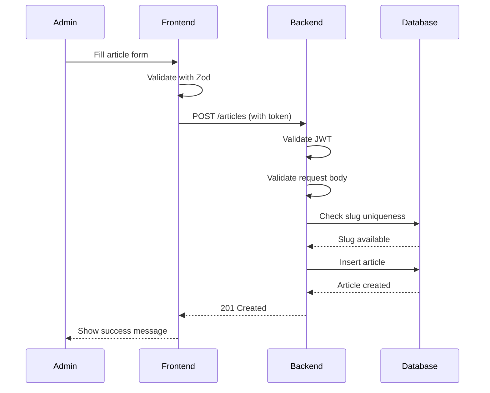
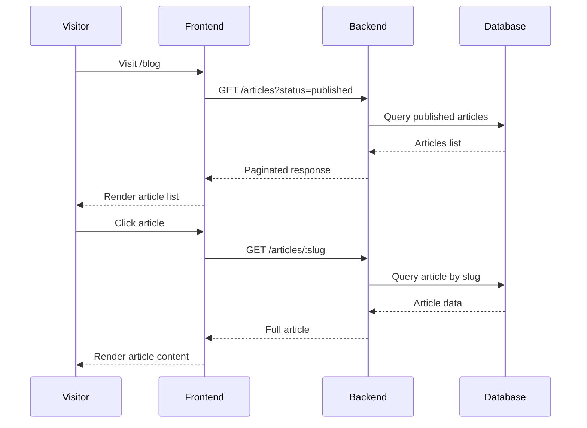

# API Documentation

## Overview

REST API documentation for Personal Portfolio CMS. All endpoints follow RESTful conventions with standardized request and response formats.

## Base URL

```
Production: https://api.yourdomain.com
Staging: https://api-staging.yourdomain.com
Local: http://localhost:3001
```

## Authentication

Most endpoints require authentication via JWT Bearer token.

### Headers

```
Authorization: Bearer <access_token>
Content-Type: application/json
```

## Response Format

### Success Response

```typescript
// Single resource
{
  "success": true,
  "data": {
    "id": "uuid",
    "slug": "article-title",
    "title": "Article Title",
    "content": "Article content...",
    "status": "published",
    "createdAt": "2024-01-01T00:00:00.000Z",
    "updatedAt": "2024-01-01T00:00:00.000Z"
  }
}

// Collection with pagination
{
  "success": true,
  "data": [
    { /* resource 1 */ },
    { /* resource 2 */ }
  ],
  "meta": {
    "page": 1,
    "limit": 10,
    "total": 100,
    "totalPages": 10
  }
}
```

### Error Response

```typescript
{
  "success": false,
  "error": {
    "code": "VALIDATION_ERROR",
    "message": "Invalid input data",
    "details": [
      {
        "field": "email",
        "message": "Invalid email format"
      }
    ]
  }
}
```

## HTTP Status Codes

| Code | Description |
|------|-------------|
| 200 | OK - Request successful |
| 201 | Created - Resource created |
| 204 | No Content - Successful deletion |
| 400 | Bad Request - Validation error |
| 401 | Unauthorized - Invalid or missing token |
| 403 | Forbidden - Insufficient permissions |
| 404 | Not Found - Resource not found |
| 409 | Conflict - Duplicate resource |
| 429 | Too Many Requests - Rate limit exceeded |
| 500 | Internal Server Error |

## Authentication Endpoints

### POST /auth/login

Login with email and password.

**Request:**
```typescript
{
  "email": "admin@example.com",
  "password": "your-password"
}
```

**Response (200):**
```typescript
{
  "success": true,
  "data": {
    "accessToken": "eyJhbGciOiJIUzI1NiIs...",
    "user": {
      "id": "uuid",
      "email": "admin@example.com",
      "role": "admin"
    }
  }
}
```

**Errors:**
- `INVALID_CREDENTIALS` - Email or password incorrect
- `ACCOUNT_LOCKED` - Too many failed attempts

---

### POST /auth/refresh

Refresh access token using refresh token from cookie.

**Cookies:**
```
refresh_token: <refresh_token_value>
```

**Response (200):**
```typescript
{
  "success": true,
  "data": {
    "accessToken": "eyJhbGciOiJIUzI1NiIs..."
  }
}
```

**Errors:**
- `REFRESH_TOKEN_EXPIRED` - Token has expired
- `REFRESH_TOKEN_INVALID` - Token not found or invalid

---

### POST /auth/logout

Logout and invalidate refresh token.

**Request:**
```typescript
{
  "refreshToken": "optional-token"
}
```

**Response (200):**
```typescript
{
  "success": true,
  "data": {
    "message": "Logged out successfully"
  }
}
```

---

### GET /auth/me

Get current authenticated user.

**Response (200):**
```typescript
{
  "success": true,
  "data": {
    "id": "uuid",
    "email": "admin@example.com",
    "role": "admin",
    "createdAt": "2024-01-01T00:00:00.000Z"
  }
}
```

## Article Endpoints

### GET /articles

Get all published articles with pagination.

**Query Parameters:**
| Parameter | Type | Default | Description |
|-----------|------|---------|-------------|
| page | number | 1 | Page number |
| limit | number | 10 | Items per page (max: 50) |
| status | string | published | Filter by status |
| search | string | - | Search in title/excerpt |
| category | string | - | Filter by category |
| tag | string | - | Filter by tag |

**Example:**
```
GET /articles?page=1&limit=10&status=published
```

**Response (200):**
```typescript
{
  "success": true,
  "data": [
    {
      "id": "uuid",
      "slug": "getting-started-with-typescript",
      "title": "Getting Started with TypeScript",
      "excerpt": "Learn the basics of TypeScript...",
      "featuredImage": "https://...",
      "status": "published",
      "author": {
        "id": "uuid",
        "email": "admin@example.com"
      },
      "publishedAt": "2024-01-15T10:00:00.000Z",
      "readingTime": 5,
      "tags": ["typescript", "javascript"]
    }
  ],
  "meta": {
    "page": 1,
    "limit": 10,
    "total": 25,
    "totalPages": 3
  }
}
```

---

### GET /articles/:slug

Get single article by slug.

**Example:**
```
GET /articles/getting-started-with-typescript
```

**Response (200):**
```typescript
{
  "success": true,
  "data": {
    "id": "uuid",
    "slug": "getting-started-with-typescript",
    "title": "Getting Started with TypeScript",
    "excerpt": "Learn the basics of TypeScript...",
    "content": "# Introduction\n\nTypeScript is...",
    "featuredImage": "https://...",
    "status": "published",
    "metaTitle": "TypeScript Tutorial for Beginners",
    "metaDescription": "Learn TypeScript from scratch...",
    "author": {
      "id": "uuid",
      "email": "admin@example.com"
    },
    "publishedAt": "2024-01-15T10:00:00.000Z",
    "createdAt": "2024-01-10T08:00:00.000Z",
    "updatedAt": "2024-01-15T10:00:00.000Z",
    "tags": ["typescript", "javascript"],
    "readingTime": 5
  }
}
```

---

### POST /articles

Create new article. **Requires authentication.**

**Request:**
```typescript
{
  "title": "Article Title",
  "slug": "article-title", // optional, auto-generated if not provided
  "excerpt": "Short description...",
  "content": "# Introduction\n\nArticle content in Markdown...",
  "featuredImage": "https://example.com/image.jpg", // optional
  "status": "draft", // draft or published
  "metaTitle": "SEO Title", // optional
  "metaDescription": "SEO Description", // optional
  "tags": ["tag1", "tag2"], // optional
  "publishedAt": "2024-01-15T10:00:00.000Z" // required if status is published
}
```

**Validation Rules:**
- `title`: Required, 3-255 characters
- `slug`: Optional, lowercase, hyphens only, unique
- `excerpt`: Required, max 500 characters
- `content`: Required, min 10 characters
- `status`: Required, enum ['draft', 'published']
- `publishedAt`: Required if status is 'published'

**Response (201):**
```typescript
{
  "success": true,
  "data": {
    "id": "uuid",
    "slug": "article-title",
    // ... full article object
  }
}
```

---

### PUT /articles/:id

Update existing article. **Requires authentication.**

**Request:**
```typescript
{
  "title": "Updated Title", // optional
  "excerpt": "Updated excerpt...", // optional
  "content": "# Updated Content\n\n...", // optional
  "status": "published", // optional
  // ... other fields to update
}
```

**Response (200):**
```typescript
{
  "success": true,
  "data": {
    "id": "uuid",
    // ... updated article object
  }
}
```

---

### DELETE /articles/:id

Delete article. **Requires authentication.**

**Response (200):**
```typescript
{
  "success": true,
  "data": {
    "message": "Article deleted successfully"
  }
}
```

## Project Endpoints

### GET /projects

Get all projects.

**Query Parameters:**
| Parameter | Type | Default | Description |
|-----------|------|---------|-------------|
| page | number | 1 | Page number |
| limit | number | 10 | Items per page |
| featured | boolean | - | Filter featured only |
| search | string | - | Search in title/description |

**Response (200):**
```typescript
{
  "success": true,
  "data": [
    {
      "id": "uuid",
      "slug": "portfolio-website",
      "title": "Portfolio Website",
      "description": "Personal portfolio website...",
      "techStack": ["React", "TypeScript", "Tailwind"],
      "githubUrl": "https://github.com/...",
      "liveUrl": "https://example.com",
      "images": ["https://..."],
      "featured": true,
      "order": 1
    }
  ],
  "meta": {
    "page": 1,
    "limit": 10,
    "total": 5,
    "totalPages": 1
  }
}
```

---

### GET /projects/:slug

Get single project by slug.

**Response (200):**
```typescript
{
  "success": true,
  "data": {
    "id": "uuid",
    "slug": "portfolio-website",
    "title": "Portfolio Website",
    "description": "Personal portfolio website...",
    "content": "Detailed project description...",
    "techStack": ["React", "TypeScript", "Tailwind"],
    "githubUrl": "https://github.com/...",
    "liveUrl": "https://example.com",
    "images": [
      "https://...",
      "https://..."
    ],
    "featured": true,
    "order": 1,
    "createdAt": "2024-01-01T00:00:00.000Z",
    "updatedAt": "2024-01-05T00:00:00.000Z"
  }
}
```

---

### POST /projects

Create new project. **Requires authentication.**

**Request:**
```typescript
{
  "title": "Project Title",
  "slug": "project-title", // optional
  "description": "Short description...",
  "content": "Detailed description...", // optional
  "techStack": ["React", "Node.js"],
  "githubUrl": "https://github.com/...", // optional
  "liveUrl": "https://example.com", // optional
  "images": ["https://..."], // optional
  "featured": false,
  "order": 1
}
```

**Response (201):**
```typescript
{
  "success": true,
  "data": {
    "id": "uuid",
    "slug": "project-title",
    // ... full project object
  }
}
```

---

### PUT /projects/:id

Update existing project. **Requires authentication.**

**Request:**
```typescript
{
  "title": "Updated Title", // optional
  "featured": true, // optional
  "order": 2 // optional
}
```

**Response (200):**
```typescript
{
  "success": true,
  "data": {
    "id": "uuid",
    // ... updated project object
  }
}
```

---

### DELETE /projects/:id

Delete project. **Requires authentication.**

**Response (200):**
```typescript
{
  "success": true,
  "data": {
    "message": "Project deleted successfully"
  }
}
```

## Category Endpoints

### GET /categories

Get all categories.

**Response (200):**
```typescript
{
  "success": true,
  "data": [
    {
      "id": "uuid",
      "name": "Web Development",
      "slug": "web-development",
      "description": "Articles about web development",
      "color": "#6366f1",
      "createdAt": "2024-01-01T00:00:00.000Z",
      "updatedAt": "2024-01-01T00:00:00.000Z"
    }
  ]
}
```

---

### GET /categories/:slug

Get single category by slug.

**Response (200):**
```typescript
{
  "success": true,
  "data": {
    "id": "uuid",
    "name": "Web Development",
    "slug": "web-development",
    "description": "Articles about web development",
    "color": "#6366f1",
    "createdAt": "2024-01-01T00:00:00.000Z",
    "updatedAt": "2024-01-01T00:00:00.000Z"
  }
}
```

---

### POST /categories

Create new category. **Requires authentication.**

**Request:**
```typescript
{
  "name": "Web Development",
  "slug": "web-development",
  "description": "Articles about web development", // optional
  "color": "#6366f1" // optional, hex color code
}
```

**Validation Rules:**
- `name`: Required, max 100 characters
- `slug`: Required, lowercase, hyphens only, unique
- `description`: Optional, max 500 characters
- `color`: Optional, hex color code (7 chars including #)

**Response (201):**
```typescript
{
  "success": true,
  "data": {
    "id": "uuid",
    "name": "Web Development",
    "slug": "web-development",
    // ... full category object
  }
}
```

---

### PUT /categories/:id

Update existing category. **Requires authentication.**

**Request:**
```typescript
{
  "name": "Updated Name", // optional
  "description": "Updated description" // optional
}
```

**Response (200):**
```typescript
{
  "success": true,
  "data": {
    "id": "uuid",
    // ... updated category object
  }
}
```

---

### DELETE /categories/:id

Delete category. **Requires authentication.**

**Response (200):**
```typescript
{
  "success": true,
  "data": null,
  "message": "Category deleted successfully"
}
```

## Media Endpoints

### POST /media/upload

Upload file. **Requires authentication.**

**Request:** `multipart/form-data`
```
file: <binary_file>
```

**Supported Formats:** JPG, PNG, WebP, GIF
**Max Size:** 5MB

**Response (201):**
```typescript
{
  "success": true,
  "data": {
    "id": "uuid",
    "url": "https://cdn.example.com/uploads/uuid.jpg",
    "filename": "image.jpg",
    "mimeType": "image/jpeg",
    "size": 1024000
  }
}
```

---

### GET /media

List uploaded files. **Requires authentication.**

**Query Parameters:**
| Parameter | Type | Default | Description |
|-----------|------|---------|-------------|
| page | number | 1 | Page number |
| limit | number | 20 | Items per page |
| search | string | - | Search by filename |

**Response (200):**
```typescript
{
  "success": true,
  "data": [
    {
      "id": "uuid",
      "url": "https://cdn.example.com/uploads/uuid.jpg",
      "filename": "image.jpg",
      "mimeType": "image/jpeg",
      "size": 1024000,
      "createdAt": "2024-01-15T10:00:00.000Z"
    }
  ],
  "meta": {
    "page": 1,
    "limit": 20,
    "total": 50,
    "totalPages": 3
  }
}
```

---

### DELETE /media/:id

Delete uploaded file. **Requires authentication.**

**Response (200):**
```typescript
{
  "success": true,
  "data": {
    "message": "File deleted successfully"
  }
}
```

## Error Codes

### Authentication Errors

| Code | HTTP Status | Description |
|------|-------------|-------------|
| INVALID_CREDENTIALS | 401 | Email or password incorrect |
| TOKEN_EXPIRED | 401 | Access token has expired |
| TOKEN_INVALID | 401 | Token is malformed or invalid |
| REFRESH_TOKEN_EXPIRED | 401 | Refresh token has expired |
| REFRESH_TOKEN_INVALID | 401 | Refresh token not found |
| ACCOUNT_LOCKED | 423 | Account locked due to failed attempts |
| INSUFFICIENT_PERMISSIONS | 403 | User lacks required role |

### Validation Errors

| Code | HTTP Status | Description |
|------|-------------|-------------|
| VALIDATION_ERROR | 400 | Request body validation failed |
| INVALID_INPUT | 400 | Input format is incorrect |
| MISSING_FIELD | 400 | Required field is missing |
| FIELD_TOO_LONG | 400 | Field exceeds maximum length |
| FIELD_TOO_SHORT | 400 | Field below minimum length |
| INVALID_ENUM | 400 | Value not in allowed options |

### Resource Errors

| Code | HTTP Status | Description |
|------|-------------|-------------|
| NOT_FOUND | 404 | Resource does not exist |
| ALREADY_EXISTS | 409 | Resource already exists (e.g., duplicate slug) |
| CONFLICT | 409 | Resource state conflict |

### Rate Limiting

| Code | HTTP Status | Description |
|------|-------------|-------------|
| RATE_LIMIT_EXCEEDED | 429 | Too many requests |

## Rate Limits

| Endpoint Type | Limit | Window |
|---------------|-------|--------|
| Public API | 100 requests | 15 minutes |
| Authenticated | 1000 requests | 15 minutes |
| Login attempts | 5 attempts | 15 minutes |

## API Flow Diagrams

### Article Creation Flow



### Public Article Access Flow



## Versioning

API versioning follows a fixed path approach without version numbers in the URL.

All breaking changes will be communicated via:
1. API deprecation headers
2. Email notification
3. Changelog documentation

## Deprecation Policy

When an endpoint is deprecated:
1. Response headers include `Deprecation: true`
2. `Sunset` header indicates deprecation date
3. Legacy endpoint available for 6 months
