# Architecture Documentation - Personal Portfolio CMS

## Overview

This document describes the clean architecture implementation for a Personal Portfolio CMS with separated Frontend and Backend within a single repository.

## Repository Structure

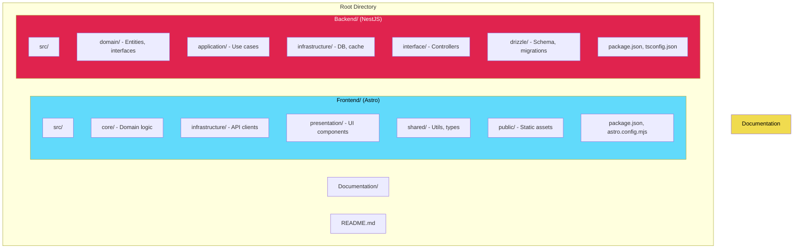

## Clean Architecture Layers

### Dependency Rule

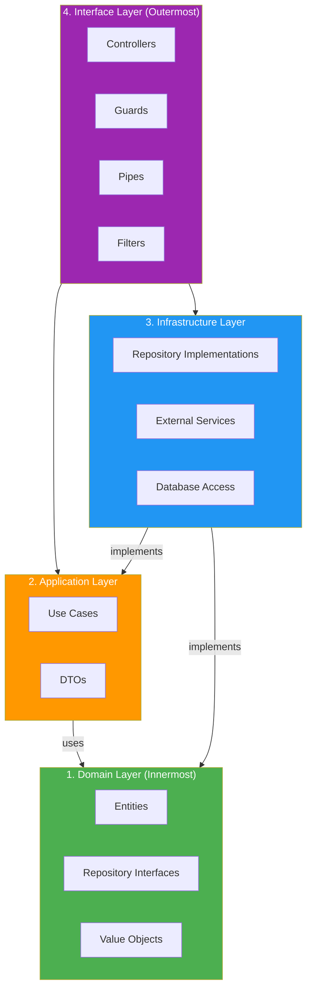

### Backend Architecture Detail

```mermaid
graph TB
    subgraph Interface["interface/ (Controllers, Guards)"]
        AUTH_CTRL["AuthController"]
        ARTICLE_CTRL["ArticleController"]
        PROJECT_CTRL["ProjectController"]
        CATEGORY_CTRL["CategoryController"]
        HEALTH_CTRL["HealthController"]
        JWT_GUARD["JwtAuthGuard"]
        THROTTLE_GUARD["ThrottlerGuard"]
        EXCEPTION_FILTER["HttpExceptionFilter"]
    end

    subgraph Application["application/ (Use Cases, DTOs)"]
        AUTH_USECASE["Auth UseCases"]
        ARTICLE_USECASE["Article UseCases"]
        PROJECT_USECASE["Project UseCases"]
        CATEGORY_USECASE["Category UseCases"]
        DTOS["Validated DTOs (class-validator)"]
    end

    subgraph Infrastructure["infrastructure/ (Implementations)"]
        USER_REPO["UserRepository"]
        ARTICLE_REPO["ArticleRepository"]
        PROJECT_REPO["ProjectRepository"]
        CATEGORY_REPO["CategoryRepository"]
        AUDIT_REPO["AuditLogRepository"]
        CACHE["CacheService / NullCacheService"]
        JWT_SVC["JwtService"]
        HASH_SVC["PasswordService"]
    end

    subgraph Domain["domain/ (Pure TypeScript)"]
        USER_ENTITY["User Entity"]
        ARTICLE_ENTITY["Article / ArticleWithAuthor"]
        PROJECT_ENTITY["Project Entity"]
        CATEGORY_ENTITY["Category Entity"]
        AUDIT_ENTITY["AuditLog Entity"]
        I_USER_REPO["IUserRepository"]
        I_ARTICLE_REPO["IArticleRepository"]
        I_PROJECT_REPO["IProjectRepository"]
        I_CATEGORY_REPO["ICategoryRepository"]
    end

    Interface --> Application
    Application --> Domain
    Infrastructure -->|implements| Domain
    Application -->|uses| Infrastructure

    style Domain fill:#4caf50,color:#fff
    style Application fill:#ff9800,color:#fff
    style Infrastructure fill:#2196f3,color:#fff
    style Interface fill:#9c27b0,color:#fff
```

### Frontend Architecture Detail

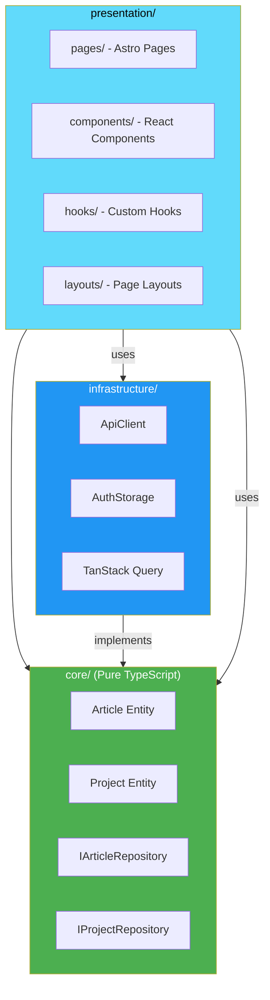

## Authentication Architecture

### Token Flow

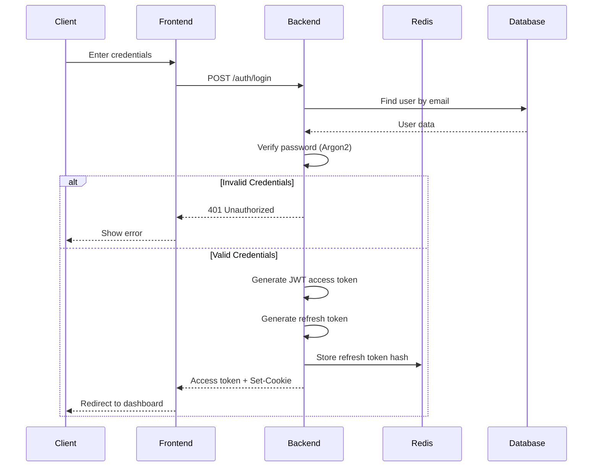

### Token Refresh Flow

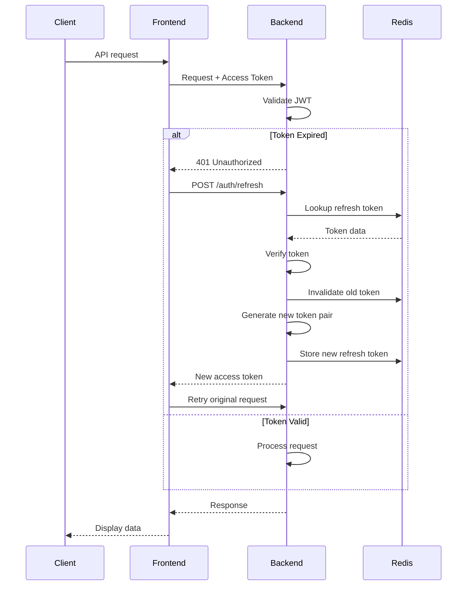

### JWT Token Structure

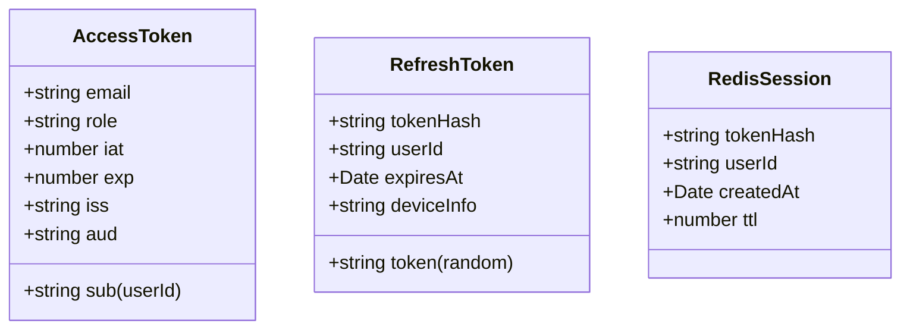

## API Design Principles

### REST Endpoints Structure

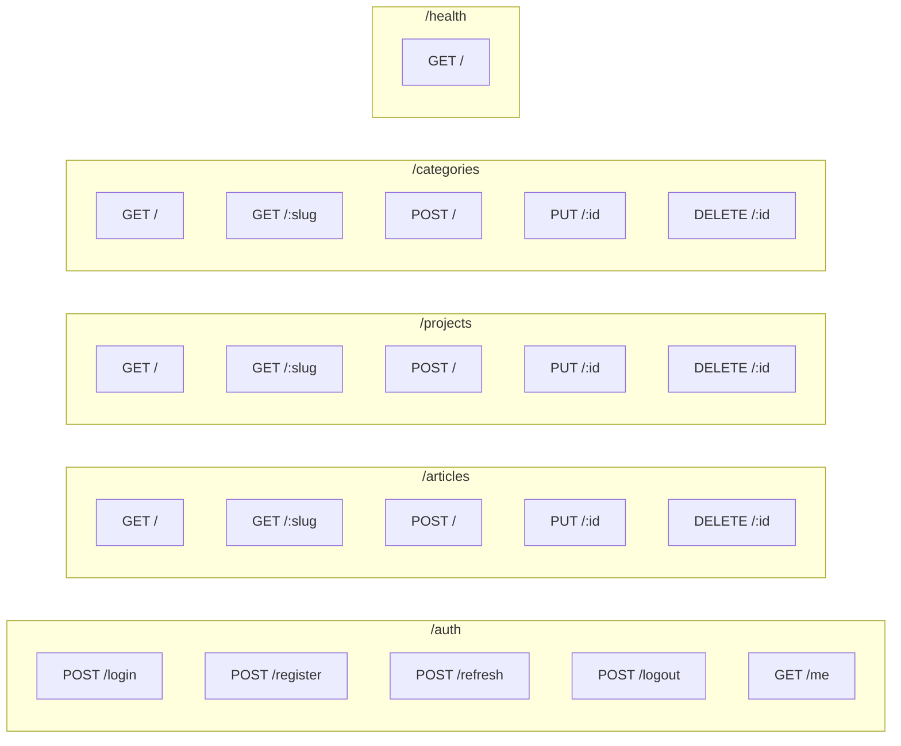

### Request/Response Flow

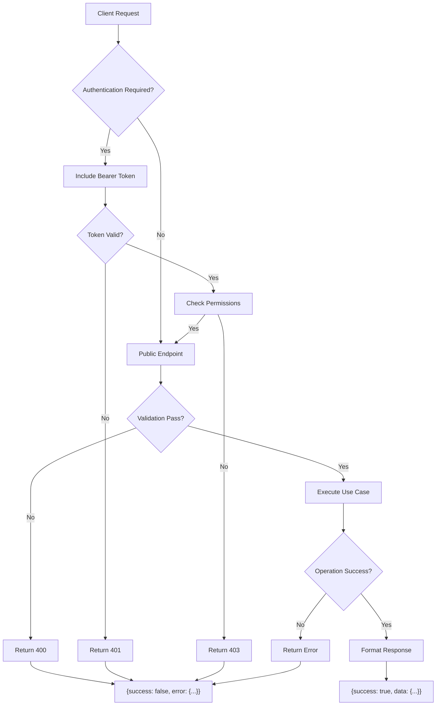

## Static Site Generation Strategy

### Astro Build Process

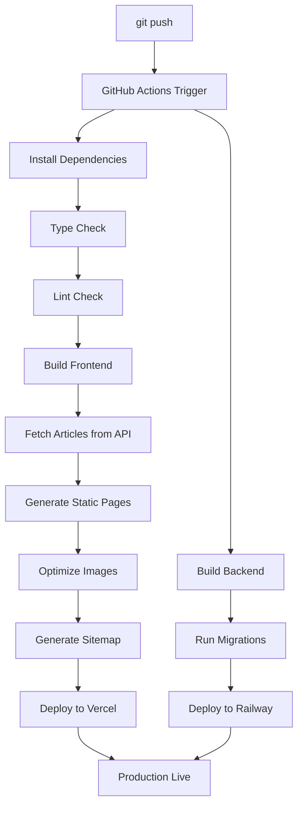

### Hybrid Rendering Strategy

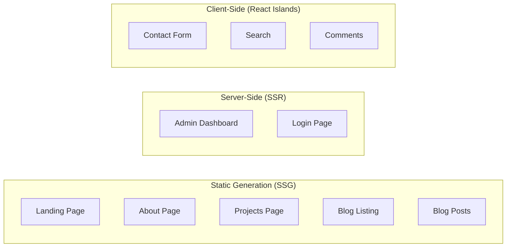

## Security Architecture

### Defense in Depth

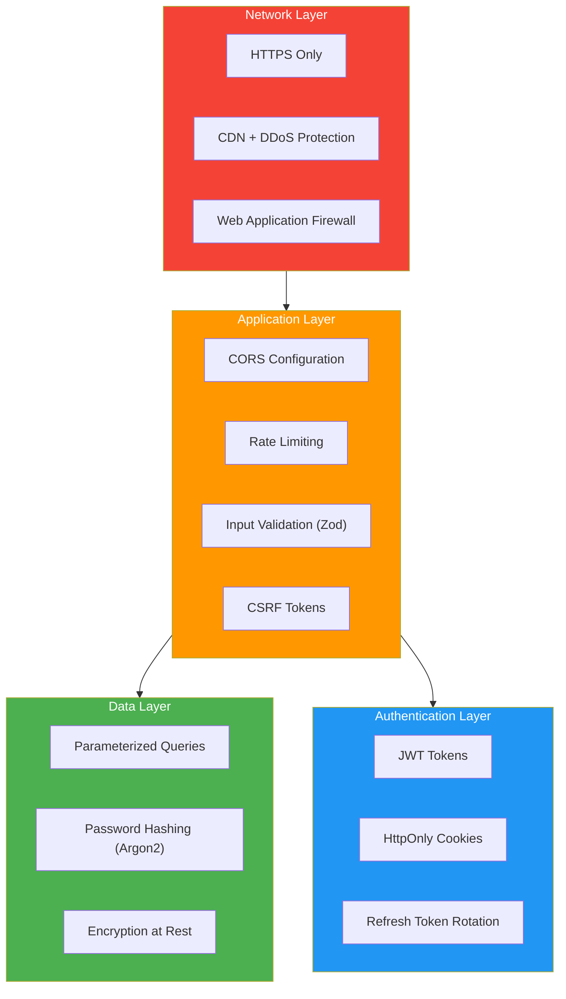

### Security Headers

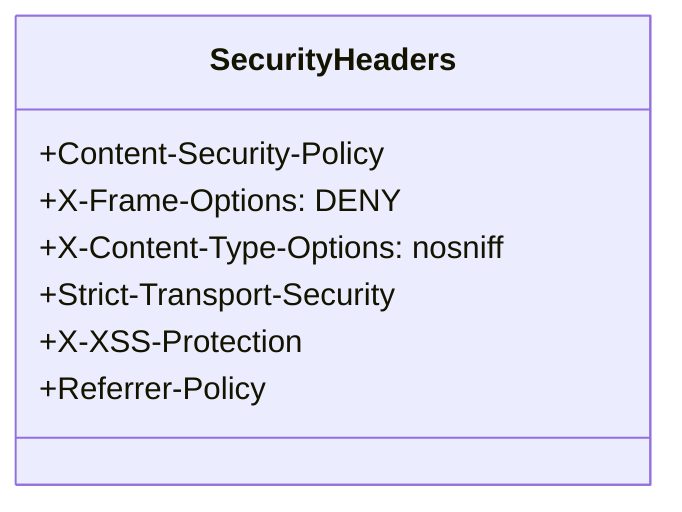

## Database Architecture

### Connection Flow

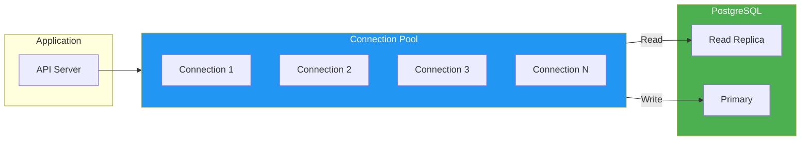

### Caching Strategy

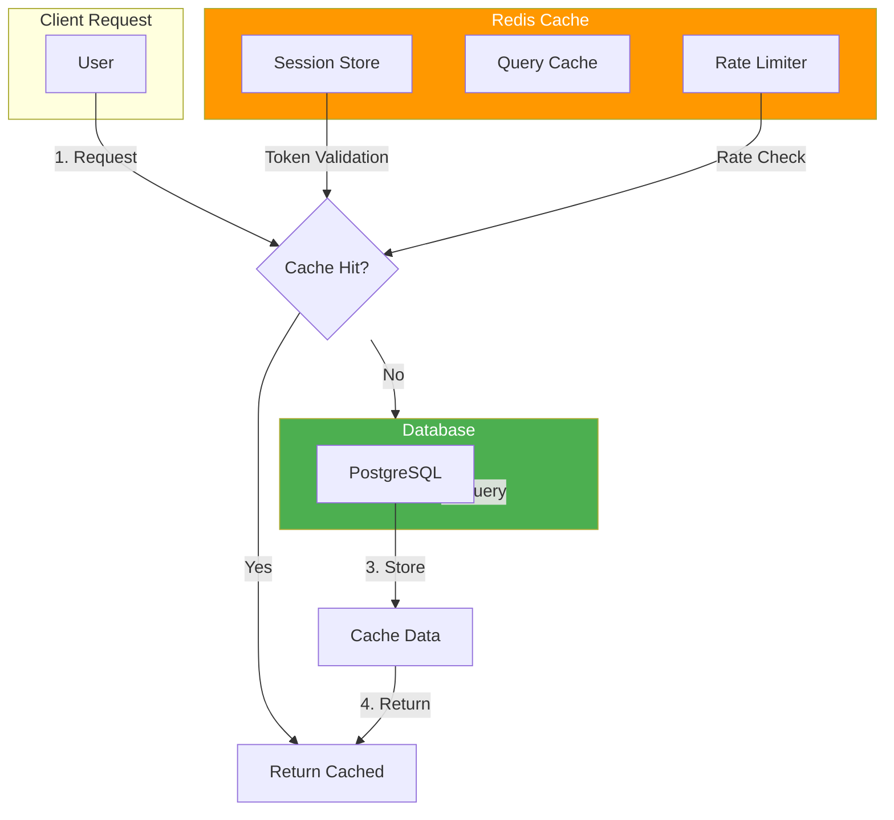

## Testing Architecture

### Test Pyramid

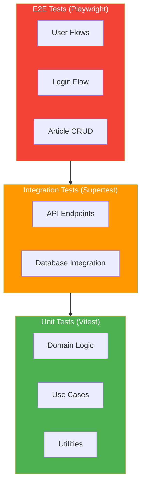

## Deployment Architecture

### Production Infrastructure

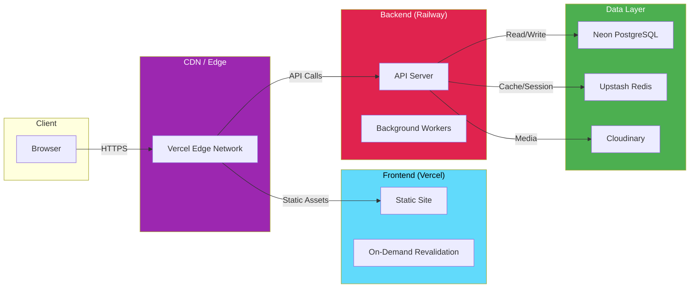

## Technology Stack Mapping

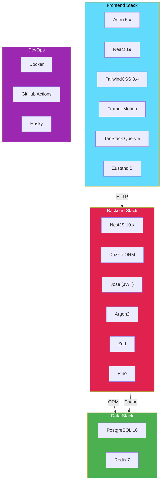

## Naming Conventions

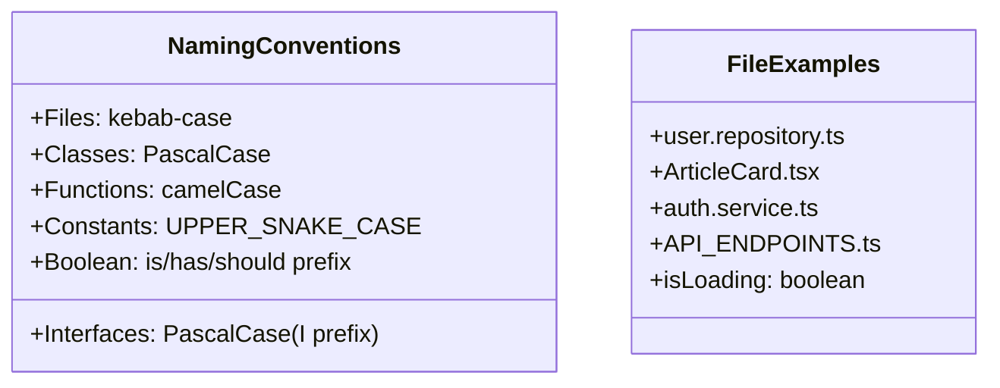

## Import Organization

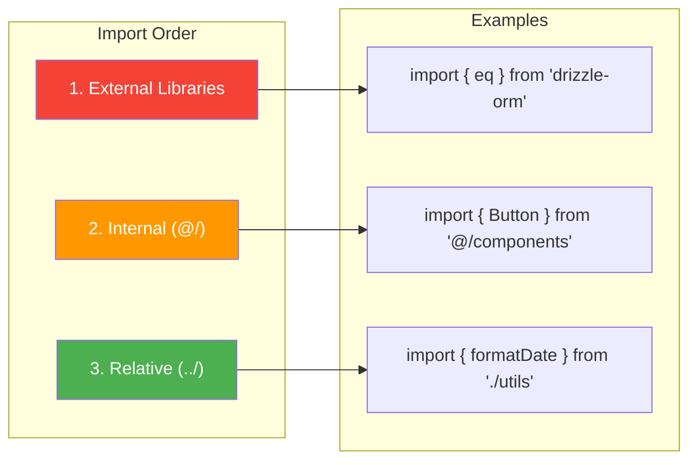

## Scalability Considerations

### Horizontal Scaling

```mermaid
flowchart TB
    subgraph LB["Load Balancer"]
        NGINX["Nginx"]
    end

    subgraph Servers["API Servers"]
        S1["Server 1"]
        S2["Server 2"]
        S3["Server N"]
    end

    subgraph Shared["Shared State"]
        REDIS["Redis Cluster"]
        PG["PostgreSQL"]
    end

    LB --> S1
    LB --> S2
    LB --> S3

    S1 --> Shared
    S2 --> Shared
    S3 --> Shared

    style LB fill:#9c27b0,color:#fff
    style Servers fill:#2196f3,color:#fff
    style Shared fill:#4caf50,color:#fff
```

### Performance Targets

```mermaid
graph LR
    subgraph Metrics["Performance Metrics"]
        FCP["FCP < 1.8s"]
        LCP["LCP < 2.5s"]
        TTI["TTI < 3.5s"]
        CLS["CLS < 0.1"]
        API["API < 200ms"]
    end
```
