# Design System Documentation

## Overview

This document defines the complete design system for Personal Portfolio CMS, ensuring visual consistency across all pages and components.

## Color Palette

### Primary Colors

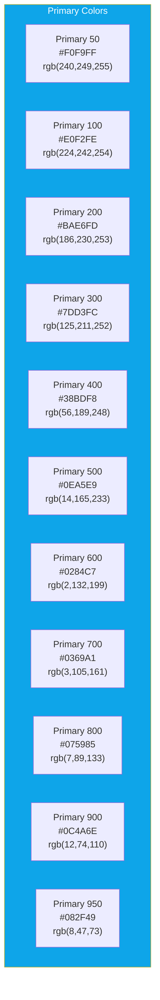

### Neutral Colors

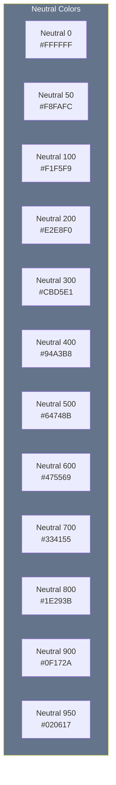

### Semantic Colors

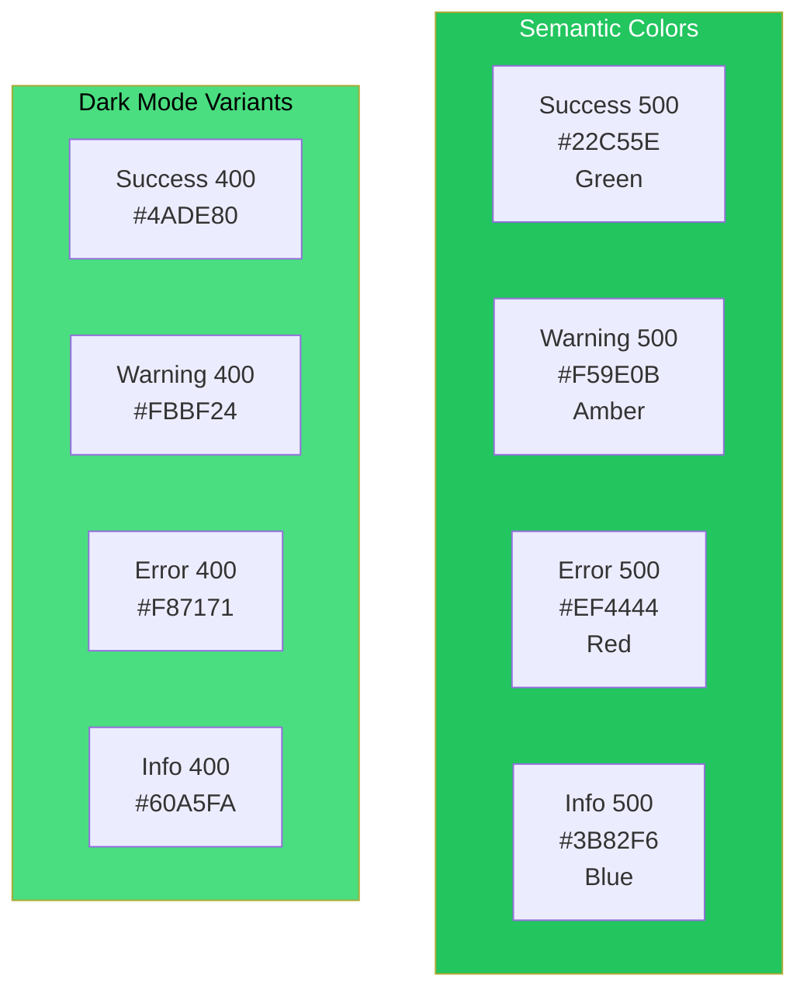

## Color Usage

### Light Mode

```css
:root {
  /* Background */
  --background: #FFFFFF;
  --background-secondary: #F8FAFC;
  --background-tertiary: #F1F5F9;

  /* Foreground */
  --foreground: #0F172A;
  --foreground-muted: #64748B;

  /* Primary */
  --primary: #0EA5E9;
  --primary-foreground: #FFFFFF;

  /* Secondary */
  --secondary: #F1F5F9;
  --secondary-foreground: #0F172A;

  /* Accent */
  --accent: #F0F9FF;
  --accent-foreground: #0EA5E9;

  /* Border */
  --border: #E2E8F0;
  --border-hover: #CBD5E1;

  /* Status */
  --success: #22C55E;
  --warning: #F59E0B;
  --error: #EF4444;
  --info: #3B82F6;
}
```

### Dark Mode

```css
.dark {
  /* Background */
  --background: #020617;
  --background-secondary: #0F172A;
  --background-tertiary: #1E293B;

  /* Foreground */
  --foreground: #F8FAFC;
  --foreground-muted: #94A3B8;

  /* Primary */
  --primary: #38BDF8;
  --primary-foreground: #0C4A6E;

  /* Secondary */
  --secondary: #1E293B;
  --secondary-foreground: #F8FAFC;

  /* Accent */
  --accent: #0C4A6E;
  --accent-foreground: #7DD3FC;

  /* Border */
  --border: #334155;
  --border-hover: #475569;

  /* Status */
  --success: #4ADE80;
  --warning: #FBBF24;
  --error: #F87171;
  --info: #60A5FA;
}
```

## Typography

### Font Family

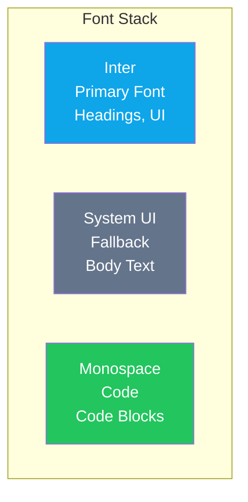

### Type Scale

| Name | Size | Weight | Line Height | Use Case |
|------|------|--------|-------------|----------|
| `text-xs` | 12px / 0.75rem | 400 | 16px / 1rem | Captions, labels |
| `text-sm` | 14px / 0.875rem | 400 | 20px / 1.25rem | Secondary text |
| `text-base` | 16px / 1rem | 400 | 24px / 1.5rem | Body text |
| `text-lg` | 18px / 1.125rem | 500 | 28px / 1.75rem | Lead text |
| `text-xl` | 20px / 1.25rem | 600 | 28px / 1.75rem | H5 |
| `text-2xl` | 24px / 1.5rem | 600 | 32px / 2rem | H4 |
| `text-3xl` | 30px / 1.875rem | 700 | 36px / 2.25rem | H3 |
| `text-4xl` | 36px / 2.25rem | 700 | 40px / 2.5rem | H2 |
| `text-5xl` | 48px / 3rem | 800 | 48px / 3rem | H1 |
| `text-6xl` | 60px / 3.75rem | 800 | 60px / 3.75rem | Hero |

### Responsive Typography

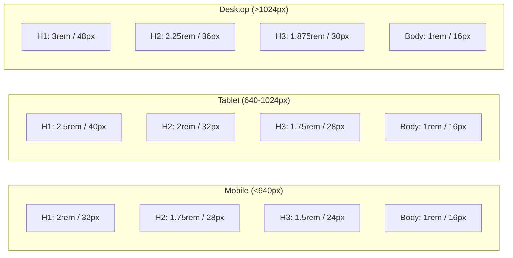

## Spacing System

### Base Grid

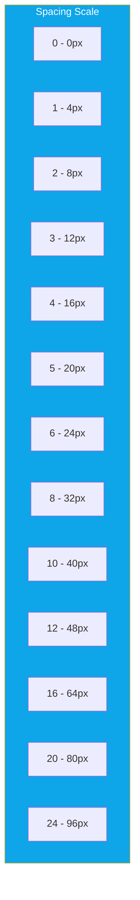

### Spacing Usage

| Token | Value | Use Case |
|-------|-------|----------|
| `space-0` | 0px | Reset, gaps |
| `space-1` | 4px | Tight gaps |
| `space-2` | 8px | Icon padding |
| `space-3` | 12px | Small padding |
| `space-4` | 16px | Default padding |
| `space-6` | 24px | Section padding |
| `space-8` | 32px | Component gap |
| `space-12` | 48px | Section gap |
| `space-16` | 64px | Large gap |
| `space-24` | 96px | Page section |

## Layout System

### Container Width

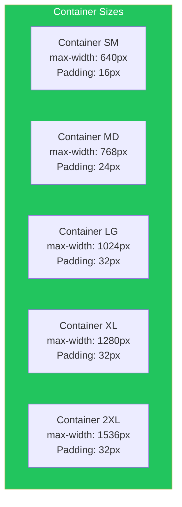

### Responsive Breakpoints

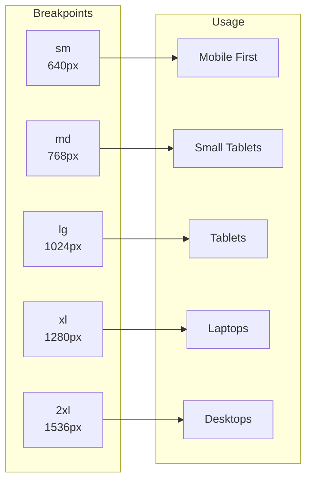

## Border Radius

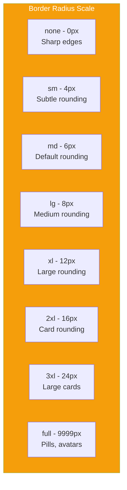

## Shadow System

### Shadow Scale

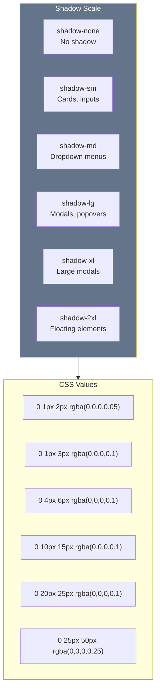

## Components

### Button System

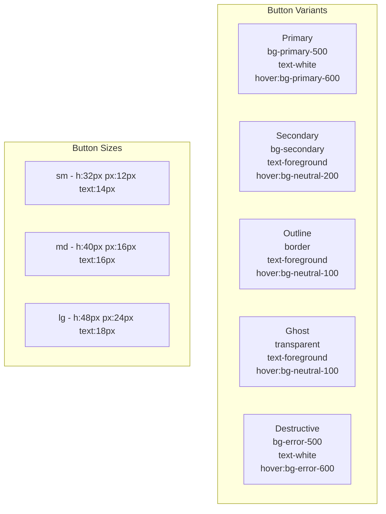

### Button States

| State | Primary | Secondary | Outline | Ghost | Destructive |
|-------|---------|-----------|---------|-------|-------------|
| Default | bg-primary-500 | bg-secondary | border | transparent | bg-error-500 |
| Hover | bg-primary-600 | bg-neutral-200 | bg-neutral-100 | bg-neutral-100 | bg-error-600 |
| Active | bg-primary-700 | bg-neutral-300 | bg-neutral-200 | bg-neutral-200 | bg-error-700 |
| Disabled | opacity-50 | opacity-50 | opacity-50 | opacity-50 | opacity-50 |
| Loading | spinner + opacity-50 | spinner + opacity-50 | spinner + opacity-50 | spinner + opacity-50 | spinner + opacity-50 |

### Input System

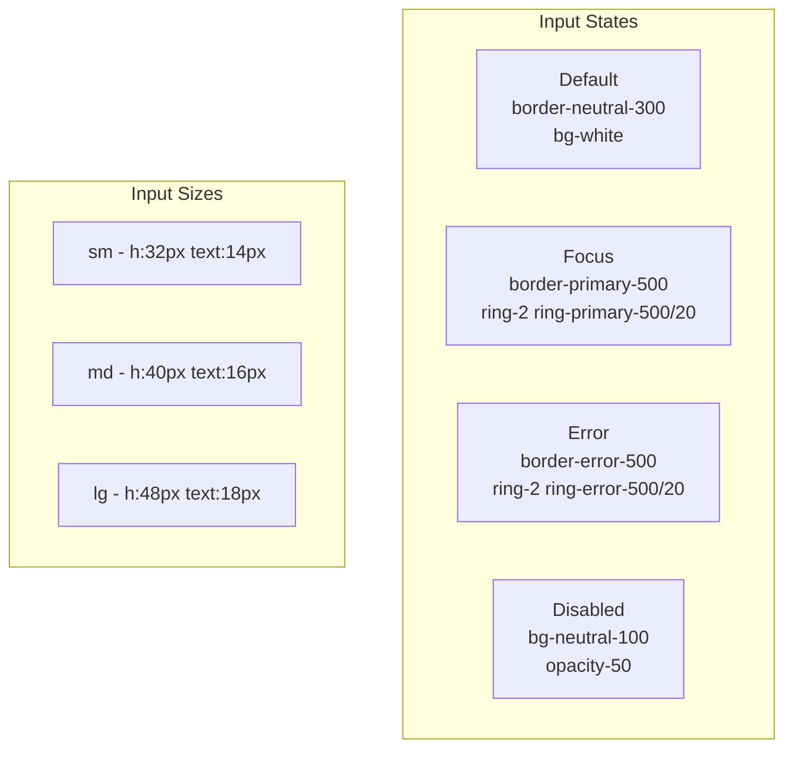

### Card Component

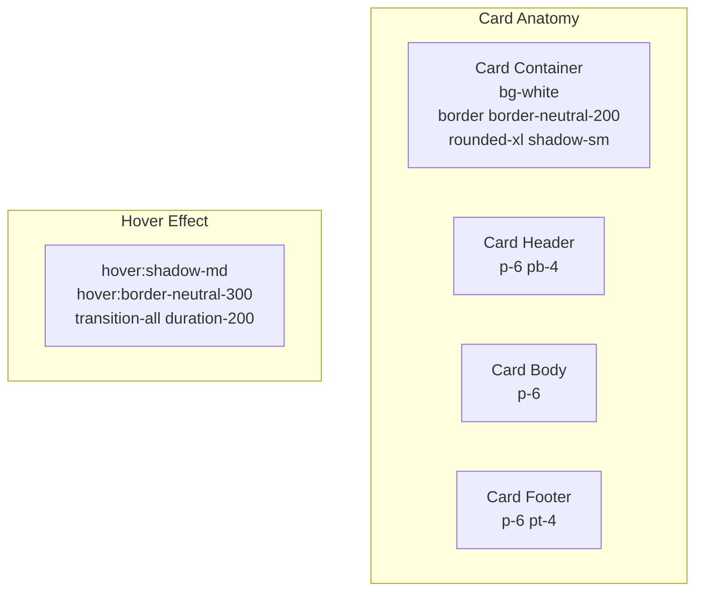

### Badge System

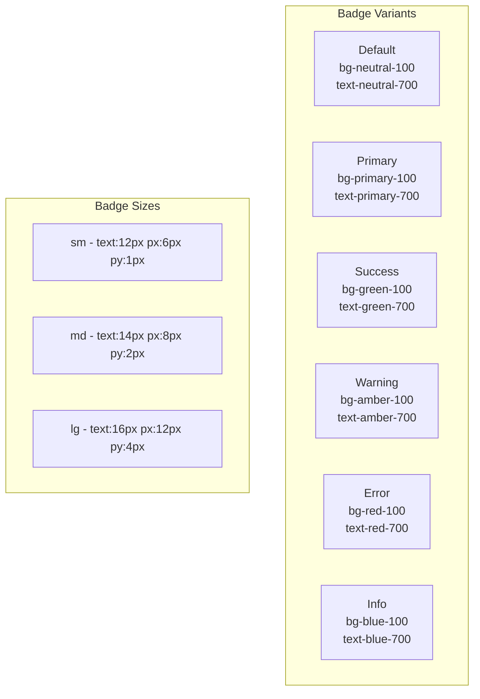

## Animation Guidelines

### Transition Timings

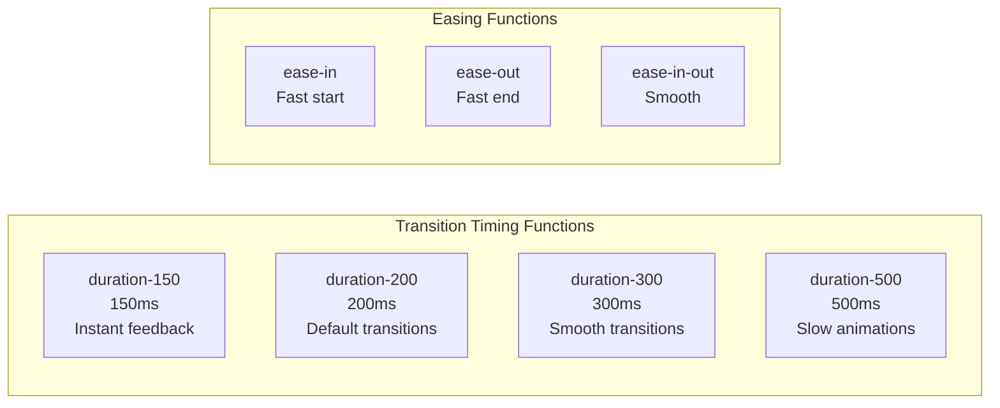

### Animation Usage

| Animation | Duration | Use Case |
|-----------|----------|----------|
| `transition-none` | 0ms | No animation |
| `transition-fast` | 150ms | Hover states, buttons |
| `transition-default` | 200ms | General transitions |
| `transition-slow` | 300ms | Modals, drawers |
| `transition-slower` | 500ms | Page transitions |

## Icon System

### Icon Sizing

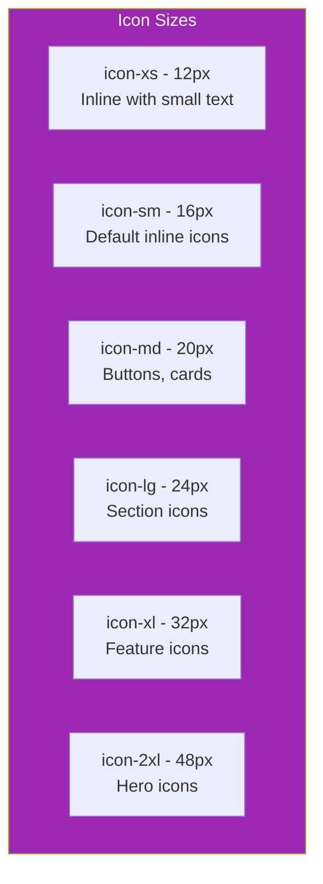

### Icon Usage

```typescript
// Icon component usage
import { Icon } from '@/components/ui/icon';

// Sizes
<Icon name="search" size="xs" />  // 12px
<Icon name="search" size="sm" />  // 16px
<Icon name="search" size="md" />  // 20px
<Icon name="search" size="lg" />  // 24px
<Icon name="search" size="xl" />  // 32px
<Icon name="search" size="2xl" /> // 48px
```

## Z-Index Scale

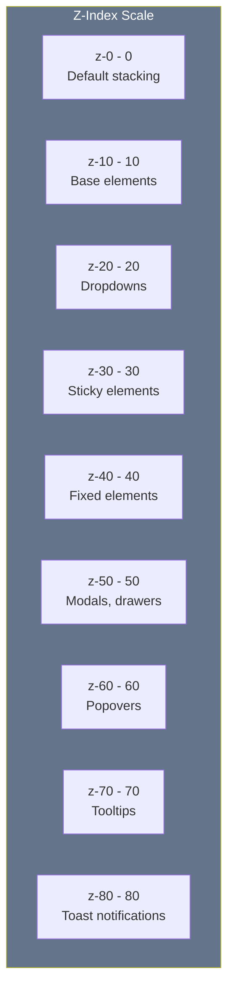

## Responsive Patterns

### Navigation

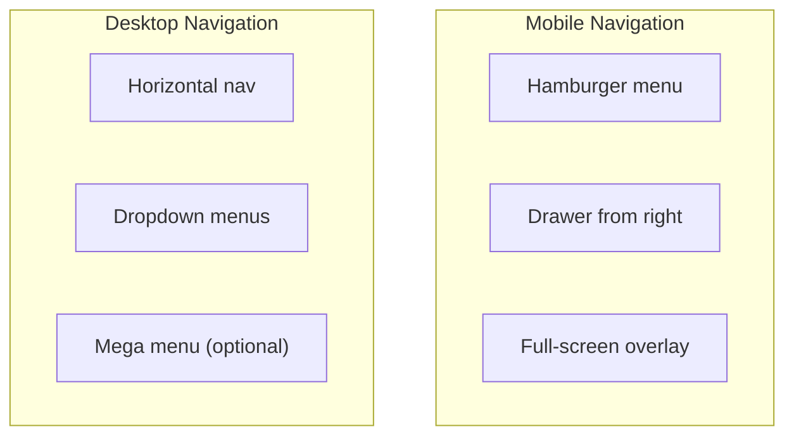

### Grid System

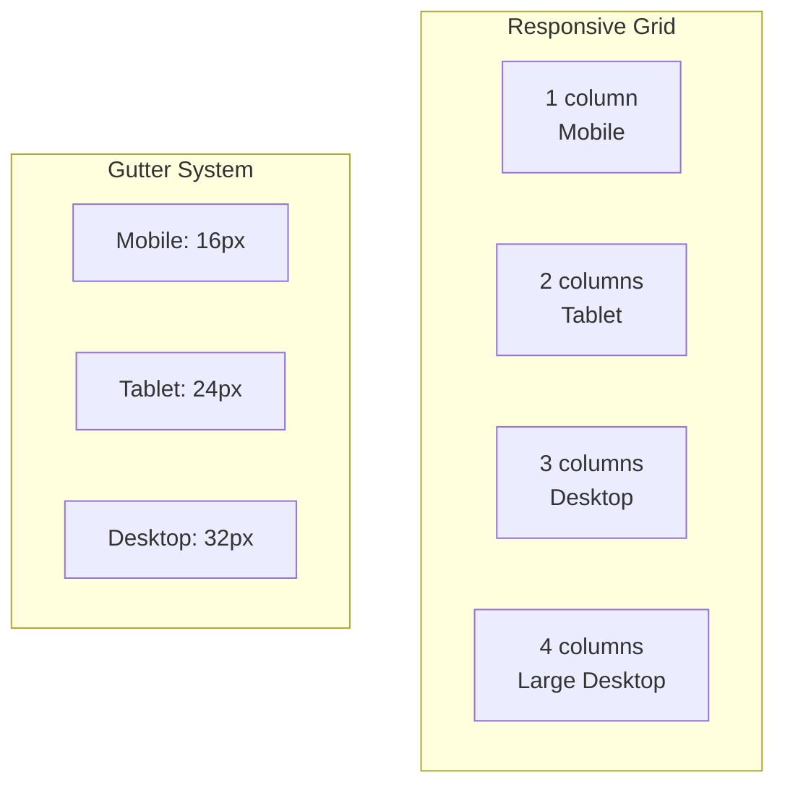

## Accessibility

### Focus States

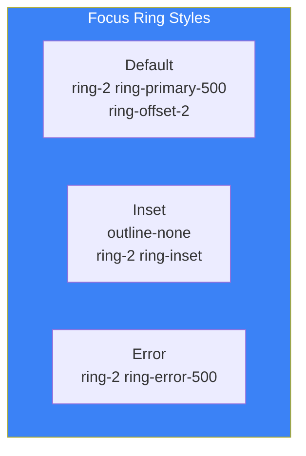

### Color Contrast

| Element | Contrast Ratio | WCAG Level |
|---------|----------------|------------|
| Text on background | 4.5:1 minimum | AA |
| Large text on background | 3:1 minimum | AA |
| UI components on background | 3:1 minimum | AA |
| Primary text on primary bg | 4.5:1 minimum | AA |

## Dark Mode Implementation

```mermaid
flowchart TD
    subgraph Trigger["Theme Trigger"]
        T1["System preference"]
        T2["Manual toggle"]
        T3["User preference (persisted)"]
    end

    subgraph Implementation["Implementation"]
        I1["class='dark' on html"]
        I2["CSS variables swap"]
        I3["Tailwind dark: prefix"]
    end

    T1 --> I1
    T2 --> I1
    T3 --> I1

    I1 --> I2
    I2 --> I3

    style Trigger fill:#F59E0B,color:#000
    style Implementation fill:#0EA5E9,color:#fff
```

## Utility Classes Reference

### Tailwind Classes Mapping

```typescript
// Color utilities
bg-primary-500     // Primary background
text-primary-500   // Primary text
border-primary-500 // Primary border
ring-primary-500   // Primary ring
hover:bg-primary-600

// Spacing utilities
p-4  // Padding all
px-4 // Padding horizontal
py-4 // Padding vertical
m-4  // Margin all
mx-auto // Margin horizontal auto
my-4 // Margin vertical

// Typography utilities
text-sm   // 14px
font-medium // Medium weight
leading-tight // 1.25
tracking-tight // -0.025em

// Layout utilities
flex      // Display flex
grid      // Display grid
hidden    // Display none
block     // Display block
inline-flex

// Responsive utilities
md:flex   // Show on md and up
lg:hidden // Hide on lg and up
xl:grid-cols-4
```

## Design Token Export

```typescript
// tokens.ts
export const tokens = {
  colors: {
    primary: {
      50: '#F0F9FF',
      100: '#E0F2FE',
      200: '#BAE6FD',
      300: '#7DD3FC',
      400: '#38BDF8',
      500: '#0EA5E9',
      600: '#0284C7',
      700: '#0369A1',
      800: '#075985',
      900: '#0C4A6E',
      950: '#082F49',
    },
    neutral: {
      0: '#FFFFFF',
      50: '#F8FAFC',
      100: '#F1F5F9',
      200: '#E2E8F0',
      300: '#CBD5E1',
      400: '#94A3B8',
      500: '#64748B',
      600: '#475569',
      700: '#334155',
      800: '#1E293B',
      900: '#0F172A',
      950: '#020617',
    },
  },
  spacing: {
    0: '0px',
    1: '4px',
    2: '8px',
    3: '12px',
    4: '16px',
    6: '24px',
    8: '32px',
    12: '48px',
    16: '64px',
    24: '96px',
  },
  radius: {
    none: '0px',
    sm: '4px',
    md: '6px',
    lg: '8px',
    xl: '12px',
    '2xl': '16px',
    '3xl': '24px',
    full: '9999px',
  },
  shadows: {
    sm: '0 1px 2px rgba(0,0,0,0.05)',
    md: '0 4px 6px rgba(0,0,0,0.1)',
    lg: '0 10px 15px rgba(0,0,0,0.1)',
    xl: '0 20px 25px rgba(0,0,0,0.1)',
    '2xl': '0 25px 50px rgba(0,0,0,0.25)',
  },
};
```
