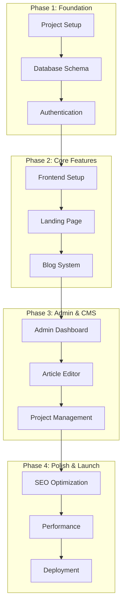
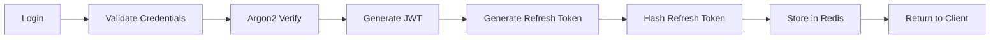
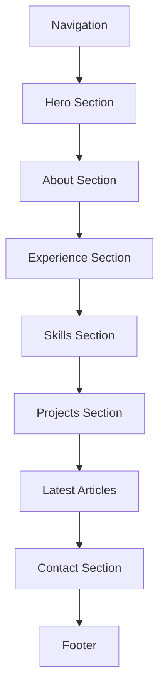
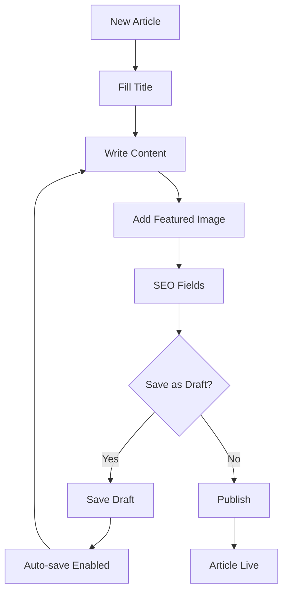
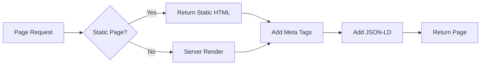
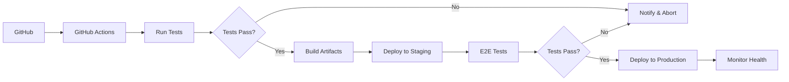
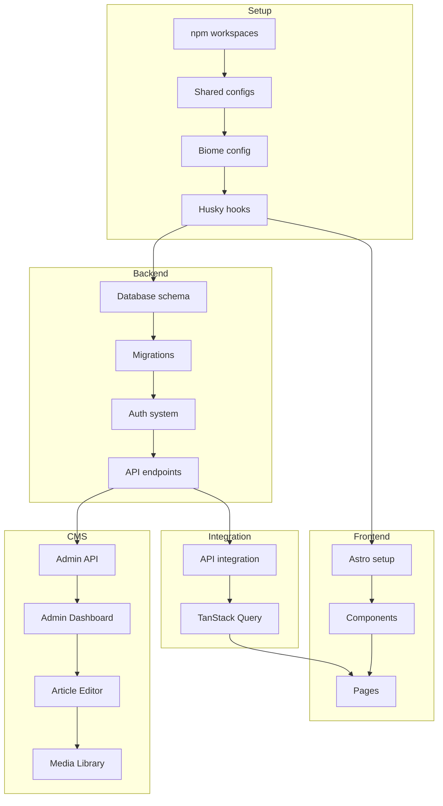

# Roadmap Documentation - Personal Portfolio CMS

## Overview

This document outlines the development roadmap for Personal Portfolio CMS. The roadmap is organized into phases with clear milestones and priorities.

## Development Phases

## Phase 1: Foundation

**Objective:** Set up project infrastructure, database, and authentication system.

### 1.1 Project Setup

| Task | Description | Priority | Complexity |
|------|-------------|----------|------------|
| Initialize Frontend | Create Astro project with React, Tailwind | High | Low |
| Initialize Backend | Create NestJS project with TypeScript | High | Low |
| Configure npm workspaces | Set up monorepo structure | Medium | Low |
| Setup Husky | Configure Git hooks | Medium | Low |
| Configure Biome | Setup linting and formatting | Medium | Low |
| Create Docker Compose | PostgreSQL and Redis for local dev | Medium | Low |

### 1.2 Database Schema

| Task | Description | Priority | Complexity |
|------|-------------|----------|------------|
| Design schema | Create all table definitions | High | Medium |
| Setup Drizzle ORM | Configure database connection | High | Medium |
| Create migrations | Generate initial migration files | High | Medium |
| Seed admin user | Create initial admin account | Medium | Low |

### 1.3 Authentication System

| Task | Description | Priority | Complexity |
|------|-------------|----------|------------|
| User entity | User model and repository | High | Medium |
| Password hashing | Argon2 implementation | High | Medium |
| JWT service | Access token generation | High | Medium |
| Refresh token | Redis-based refresh token | High | High |
| Login endpoint | POST /auth/login | High | Medium |
| Refresh endpoint | POST /auth/refresh | High | Medium |
| Logout endpoint | POST /auth/logout | Medium | Medium |
| Auth guard | JWT validation guard | High | Medium |
| Rate limiting | Login attempt protection | Medium | Medium |

**Authentication Architecture:**

## Phase 2: Core Features

**Objective:** Build the public-facing frontend with landing page and blog system.

### 2.1 Frontend Setup

| Task | Description | Priority | Complexity |
|------|-------------|----------|------------|
| Configure Astro | Setup hybrid rendering | High | Medium |
| Setup Tailwind | Configure theme and plugins | High | Low |
| Create layouts | Base, public, admin layouts | High | Medium |
| Setup TanStack Query | Server state management | High | Medium |
| Setup Zustand | Client state management | Medium | Low |
| Create shared types | Import from backend types | Medium | Low |

### 2.2 Landing Page

| Task | Description | Priority | Complexity |
|------|-------------|----------|------------|
| Hero section | Headline, subtitle, CTA buttons | High | Medium |
| About section | Personal bio with photo | High | Low |
| Skills section | Tech stack showcase | High | Low |
| Experience section | Timeline of work experience | High | Medium |
| Projects section | Featured projects grid | High | Medium |
| Contact section | Contact form integration | Medium | Medium |
| Footer | Social links and copyright | Medium | Low |
| Navigation | Fixed header with smooth scroll | High | Medium |

**Landing Page Structure:**

### 2.3 Blog System

| Task | Description | Priority | Complexity |
|------|-------------|----------|------------|
| Article listing | Paginated list with filters | High | Medium |
| Article detail | Full article view with styling | High | Medium |
| Markdown rendering | Support for MDX content | High | Medium |
| Syntax highlighting | Code blocks with highlighting | High | Medium |
| Table of contents | Auto-generated from headings | Medium | Medium |
| Reading time | Estimate reading duration | Low | Low |
| Share buttons | Social media sharing | Low | Low |
| Related articles | Show related content | Low | Medium |

## Phase 3: Admin & CMS

**Objective:** Build the admin dashboard for content management.

### 3.1 Admin Dashboard

| Task | Description | Priority | Complexity |
|------|-------------|----------|------------|
| Login page | Admin authentication UI | High | Low |
| Dashboard layout | Sidebar navigation | High | Medium |
| Overview stats | Article and project counts | Medium | Low |
| Quick actions | Common tasks shortcuts | Low | Low |

### 3.2 Article Editor

| Task | Description | Priority | Complexity |
|------|-------------|----------|------------|
| Create article | Form with all fields | High | High |
| Edit article | Pre-populated form | High | High |
| Delete article | Confirmation dialog | Medium | Low |
| Draft/Publish | Status toggle | High | Low |
| Auto-save | Save draft automatically | Medium | High |
| Preview | Preview before publish | Medium | High |
| Image upload | Featured image upload | Medium | High |
| SEO fields | Meta title, description | Medium | Medium |

**Article Editor Flow:**

### 3.3 Project Management

| Task | Description | Priority | Complexity |
|------|-------------|----------|------------|
| Create project | Project form with images | High | Medium |
| Edit project | Update existing project | High | Medium |
| Delete project | Remove with confirmation | Medium | Low |
| Image gallery | Multiple image upload | Medium | High |
| Tech stack | Technology tags input | Medium | Medium |
| Ordering | Drag-drop reordering | Low | High |

### 3.4 Media Library

| Task | Description | Priority | Complexity |
|------|-------------|----------|------------|
| Upload API | File upload endpoint | High | Medium |
| Browse files | Grid view of uploads | Medium | Low |
| Delete file | Remove uploaded file | Medium | Low |
| Copy URL | Quick copy to clipboard | Low | Low |

## Phase 4: Polish & Launch

**Objective:** Optimize for SEO, performance, and deploy to production.

### 4.1 SEO Optimization

| Task | Description | Priority | Complexity |
|------|-------------|----------|------------|
| Meta tags | Dynamic meta for each page | High | Medium |
| Open Graph | Social sharing images | High | Low |
| JSON-LD | Structured data markup | High | Medium |
| Sitemap | Auto-generated sitemap | High | Low |
| Robots.txt | Search engine directives | Medium | Low |
| Canonical URLs | Prevent duplicate content | Medium | Low |

**SEO Implementation:**

### 4.2 Performance

| Task | Description | Priority | Complexity |
|------|-------------|----------|------------|
| Image optimization | Auto-optimization | High | Medium |
| Code splitting | Lazy load routes | High | Medium |
| Caching headers | Static asset caching | Medium | Low |
| GZIP compression | Response compression | Medium | Low |
| Lighthouse audit | Performance scoring | High | Low |

### 4.3 Deployment

| Task | Description | Priority | Complexity |
|------|-------------|----------|------------|
| Vercel setup | Frontend deployment | High | Low |
| Railway setup | Backend deployment | High | Medium |
| Environment vars | Configure production secrets | High | Low |
| Database setup | Neon PostgreSQL | High | Low |
| Redis setup | Upstash Redis | Medium | Low |
| CI/CD pipeline | GitHub Actions | High | Medium |
| Health checks | Endpoint monitoring | Medium | Low |

**Deployment Architecture:**

## Task Priority Legend

| Priority | Description |
|----------|-------------|
| **High** | Must complete for MVP |
| **Medium** | Important but deferrable |
| **Low** | Nice to have |

## Complexity Legend

| Complexity | Description |
|------------|-------------|
| **Low** | Straightforward, minimal dependencies |
| **Medium** | Requires some planning, few dependencies |
| **High** | Complex, many interdependencies |

## Milestones

### Milestone 1: Foundation Complete
- [ ] Project setup for Frontend and Backend
- [ ] Database schema with migrations
- [ ] Working authentication system
- [ ] Git hooks configured

### Milestone 2: Public Site Live
- [ ] Landing page with all sections
- [ ] Blog listing and detail pages
- [ ] Static site generation working
- [ ] SEO meta tags implemented

### Milestone 3: CMS Operational
- [ ] Admin dashboard accessible
- [ ] Article CRUD fully functional
- [ ] Project management working
- [ ] Media upload operational

### Milestone 4: Production Ready
- [ ] Deployed to production
- [ ] All tests passing
- [ ] Performance optimized
- [ ] Security audit passed

## Dependencies Map

## Future Enhancements

### Phase 5: Enhanced Features (Post-Launch)
| Feature | Description |
|---------|-------------|
| Multi-language | i18n support |
| Comments | Article commenting system |
| Newsletter | Email subscription |
| Analytics | Advanced visitor analytics |

### Phase 6: Scalability
| Feature | Description |
|---------|-------------|
| CDN | Global content delivery |
| Caching | Full-page caching |
| Monitoring | APM integration |
| Scaling | Horizontal scaling setup |

## Definition of Complete

Each phase is considered complete when:

1. All high-priority tasks are finished
2. Code is reviewed and linted
3. Tests are passing
4. Documentation is updated
5. No critical bugs reported
