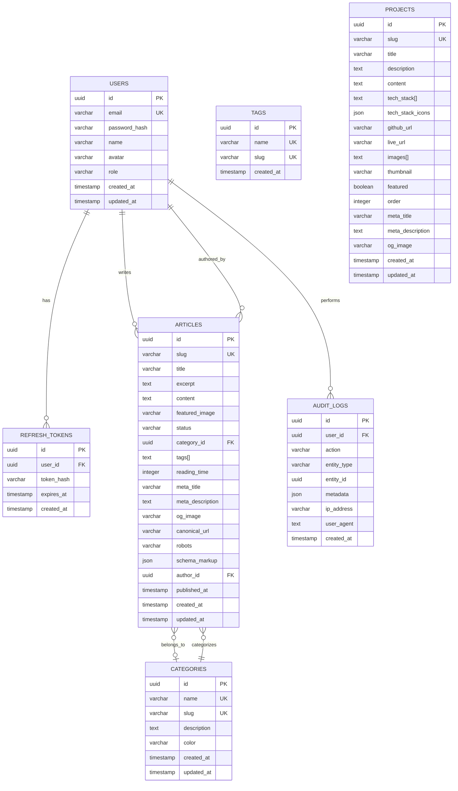

# Database Schema Documentation

## Overview

PostgreSQL database schema with Drizzle ORM for Personal Portfolio CMS.

## Entity Relationship Diagram

## Tables

### Users

| Column | Type | Constraints | Description |
|--------|------|-------------|-------------|
| `id` | UUID | PK, DEFAULT gen_random_uuid() | Unique identifier |
| `email` | VARCHAR(255) | NOT NULL, UNIQUE | User email address |
| `password_hash` | VARCHAR(255) | NOT NULL | Argon2 password hash |
| `name` | VARCHAR(255) | NULLABLE | Display name for author attribution |
| `avatar` | VARCHAR(500) | NULLABLE | Avatar image URL |
| `role` | VARCHAR(50) | NOT NULL, DEFAULT 'admin' | User role |
| `created_at` | TIMESTAMP | NOT NULL, DEFAULT NOW() | Creation timestamp |
| `updated_at` | TIMESTAMP | NOT NULL, DEFAULT NOW() | Last update timestamp |

### Categories

| Column | Type | Constraints | Description |
|--------|------|-------------|-------------|
| `id` | UUID | PK, DEFAULT gen_random_uuid() | Unique identifier |
| `name` | VARCHAR(100) | NOT NULL, UNIQUE | Category name |
| `slug` | VARCHAR(100) | NOT NULL, UNIQUE | URL-friendly identifier |
| `description` | TEXT | NULLABLE | Category description |
| `color` | VARCHAR(7) | DEFAULT '#6366f1' | Hex color code for UI badges |
| `created_at` | TIMESTAMP | NOT NULL, DEFAULT NOW() | Creation timestamp |
| `updated_at` | TIMESTAMP | NOT NULL, DEFAULT NOW() | Last update timestamp |

### Tags

| Column | Type | Constraints | Description |
|--------|------|-------------|-------------|
| `id` | UUID | PK, DEFAULT gen_random_uuid() | Unique identifier |
| `name` | VARCHAR(100) | NOT NULL, UNIQUE | Tag name |
| `slug` | VARCHAR(100) | NOT NULL, UNIQUE | URL-friendly identifier |
| `created_at` | TIMESTAMP | NOT NULL, DEFAULT NOW() | Creation timestamp |

### Articles

| Column | Type | Constraints | Description |
|--------|------|-------------|-------------|
| `id` | UUID | PK, DEFAULT gen_random_uuid() | Unique identifier |
| `slug` | VARCHAR(255) | NOT NULL, UNIQUE | URL-friendly identifier |
| `title` | VARCHAR(255) | NOT NULL | Article title |
| `excerpt` | TEXT | NOT NULL | Short summary/description |
| `content` | TEXT | NOT NULL | Full article content (Markdown) |
| `featured_image` | VARCHAR(500) | NULLABLE | Hero/banner image URL |
| `status` | VARCHAR(50) | NOT NULL, DEFAULT 'draft' | Publication status (draft/published) |
| `category_id` | UUID | FK → categories.id, ON DELETE SET NULL | Article category |
| `tags` | TEXT[] | NOT NULL, DEFAULT '{}' | Array of tag strings |
| `reading_time` | INTEGER | DEFAULT 0 | Estimated reading time in minutes |
| `meta_title` | VARCHAR(60) | NULLABLE | SEO title (max 60 chars for Google) |
| `meta_description` | TEXT | NULLABLE | SEO description (max 160 chars recommended) |
| `og_image` | VARCHAR(500) | NULLABLE | Open Graph image URL |
| `canonical_url` | VARCHAR(500) | NULLABLE | Canonical URL for SEO |
| `robots` | VARCHAR(100) | DEFAULT 'index,follow' | Robots meta directive |
| `schema_markup` | JSON | NULLABLE | JSON-LD structured data |
| `author_id` | UUID | FK → users.id, NOT NULL | Article author reference |
| `published_at` | TIMESTAMP | NULLABLE | Publication date |
| `created_at` | TIMESTAMP | NOT NULL, DEFAULT NOW() | Creation timestamp |
| `updated_at` | TIMESTAMP | NOT NULL, DEFAULT NOW() | Last update timestamp |

### Projects

| Column | Type | Constraints | Description |
|--------|------|-------------|-------------|
| `id` | UUID | PK, DEFAULT gen_random_uuid() | Unique identifier |
| `slug` | VARCHAR(255) | NOT NULL, UNIQUE | URL-friendly identifier |
| `title` | VARCHAR(255) | NOT NULL | Project title |
| `description` | TEXT | NOT NULL | Short project description |
| `content` | TEXT | NULLABLE | Detailed project writeup (Markdown) |
| `tech_stack` | TEXT[] | NOT NULL, DEFAULT '{}' | Technology names array |
| `tech_stack_icons` | JSON | NOT NULL, DEFAULT '[]' | Array of {name, icon} objects |
| `github_url` | VARCHAR(500) | NULLABLE | GitHub repository URL |
| `live_url` | VARCHAR(500) | NULLABLE | Live demo URL |
| `images` | TEXT[] | NOT NULL, DEFAULT '{}' | Gallery image URLs |
| `thumbnail` | VARCHAR(500) | NULLABLE | Thumbnail/preview image URL |
| `featured` | BOOLEAN | NOT NULL, DEFAULT false | Featured project flag |
| `order` | INTEGER | NOT NULL, DEFAULT 0 | Display order (lower = first) |
| `meta_title` | VARCHAR(60) | NULLABLE | SEO title |
| `meta_description` | TEXT | NULLABLE | SEO description |
| `og_image` | VARCHAR(500) | NULLABLE | Open Graph image URL |
| `created_at` | TIMESTAMP | NOT NULL, DEFAULT NOW() | Creation timestamp |
| `updated_at` | TIMESTAMP | NOT NULL, DEFAULT NOW() | Last update timestamp |

### Refresh Tokens

| Column | Type | Constraints | Description |
|--------|------|-------------|-------------|
| `id` | UUID | PK, DEFAULT gen_random_uuid() | Unique identifier |
| `user_id` | UUID | FK → users.id, ON DELETE CASCADE | Token owner |
| `token_hash` | VARCHAR(255) | NOT NULL | Hashed refresh token |
| `expires_at` | TIMESTAMP | NOT NULL | Token expiration |
| `created_at` | TIMESTAMP | NOT NULL, DEFAULT NOW() | Creation timestamp |

### Audit Logs

| Column | Type | Constraints | Description |
|--------|------|-------------|-------------|
| `id` | UUID | PK, DEFAULT gen_random_uuid() | Unique identifier |
| `user_id` | UUID | FK → users.id, ON DELETE SET NULL | Acting user |
| `action` | VARCHAR(100) | NOT NULL | Action performed (CREATE, UPDATE, DELETE, LOGIN, etc.) |
| `entity_type` | VARCHAR(100) | NOT NULL | Entity type (article, project, user) |
| `entity_id` | UUID | NULLABLE | Affected entity ID |
| `metadata` | JSON | NULLABLE | Additional context data |
| `ip_address` | VARCHAR(45) | NULLABLE | Client IP address |
| `user_agent` | TEXT | NULLABLE | Client user agent string |
| `created_at` | TIMESTAMP | NOT NULL, DEFAULT NOW() | Action timestamp |

## Migrations

| Migration | Description |
|-----------|-------------|
| `0000_secret_photon.sql` | Initial schema: users, articles, projects, refresh_tokens, audit_logs |
| `0001_optimal_molten_man.sql` | Add SEO fields (og_image, canonical_url, robots, schema_markup) and project extras (tech_stack_icons, thumbnail) |
| `0002_sloppy_ozymandias.sql` | Add categories/tags tables, article category_id/tags/reading_time, project SEO fields, user name/avatar |

## SEO Fields Strategy

Articles include comprehensive SEO support:
- **`meta_title`** (max 60 chars): Custom title tag, falls back to article title
- **`meta_description`** (max 160 chars): Custom meta description, falls back to excerpt
- **`og_image`**: Open Graph image for social sharing
- **`canonical_url`**: Prevents duplicate content issues
- **`robots`**: Controls search engine indexing behavior
- **`schema_markup`**: JSON-LD structured data for rich snippets
- **`reading_time`**: Auto-calculated based on word count (200 wpm average)

Projects include essential SEO fields:
- **`meta_title`**, **`meta_description`**, **`og_image`**: For project detail pages
