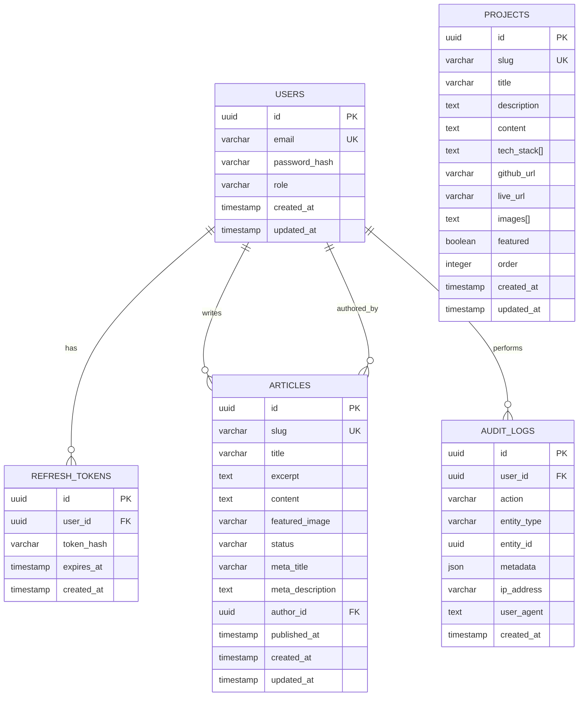
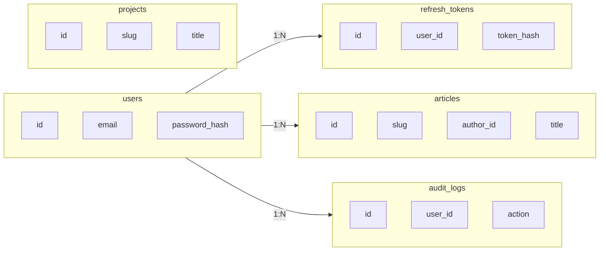
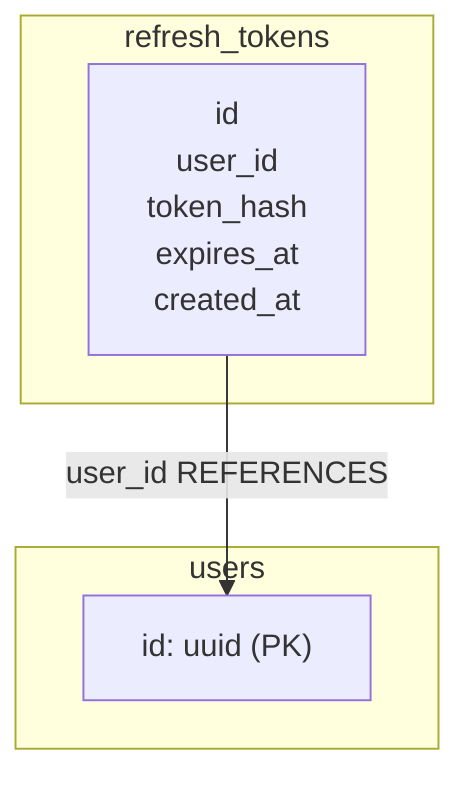
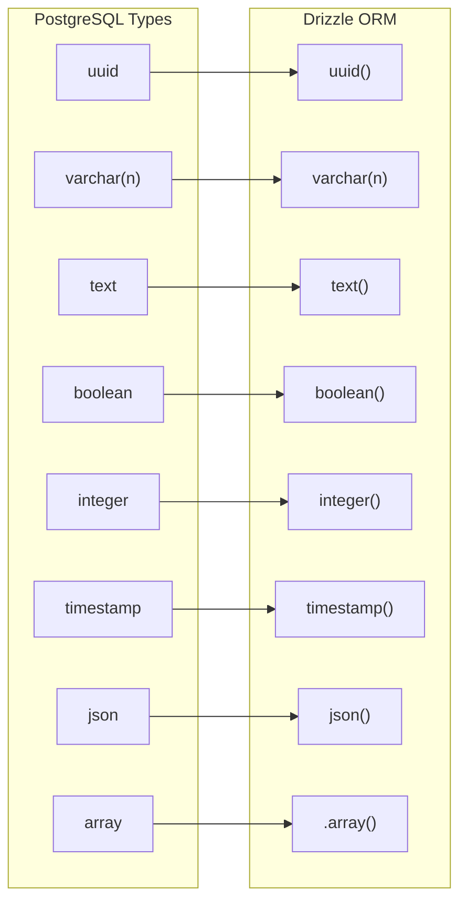
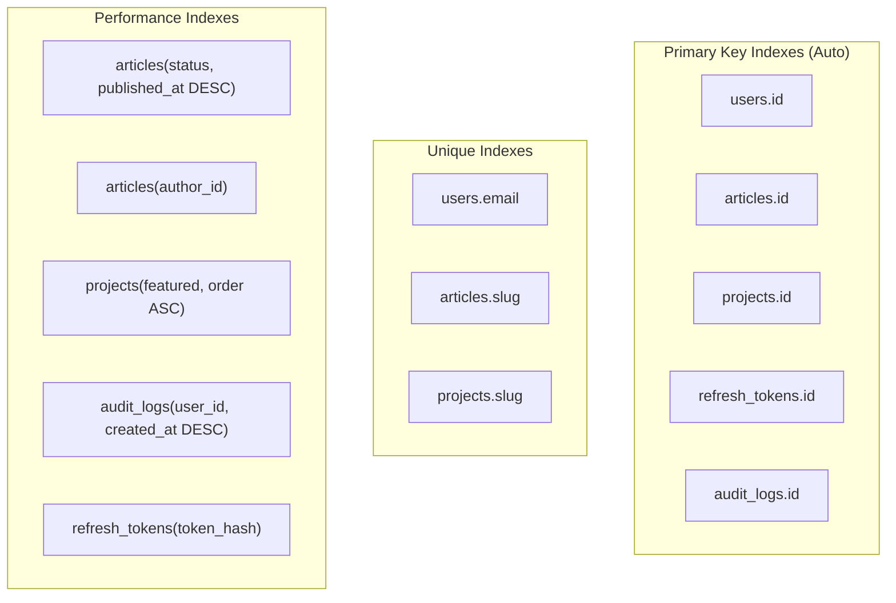
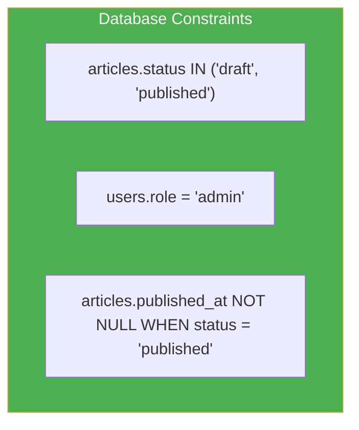
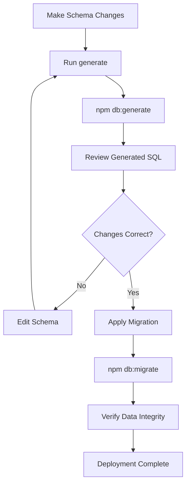
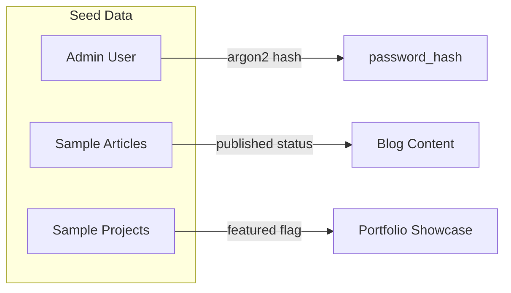
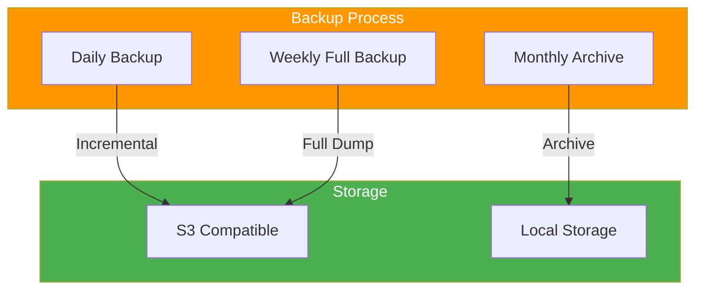
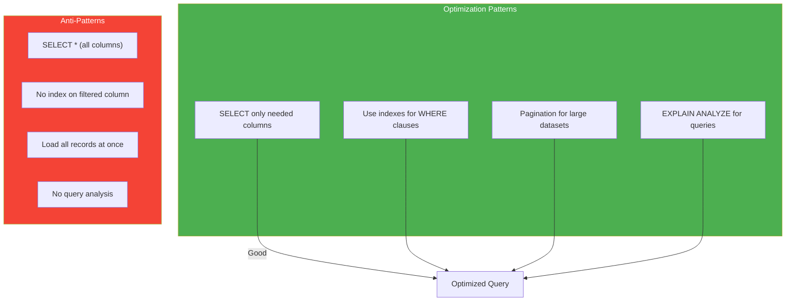

# Database Schema Documentation

## Overview

PostgreSQL database schema with Drizzle ORM for Personal Portfolio CMS.

## Entity Relationship Diagram



## Table Relationships



## Table Definitions

### users

Stores admin user information for CMS access.

```typescript
export const users = pgTable('users', {
  id: uuid('id').primaryKey().defaultRandom(),
  email: varchar('email', { length: 255 }).notNull().unique(),
  passwordHash: varchar('password_hash', { length: 255 }).notNull(),
  role: varchar('role', { length: 50 }).notNull().default('admin'),
  createdAt: timestamp('created_at').defaultNow().notNull(),
  updatedAt: timestamp('updated_at').defaultNow().notNull(),
});
```

**Fields:**

| Field | Type | Constraints | Description |
|-------|------|-------------|-------------|
| `id` | UUID | PK, DEFAULT random() | Primary key |
| `email` | VARCHAR(255) | NOT NULL, UNIQUE | User email address |
| `password_hash` | VARCHAR(255) | NOT NULL | Argon2 hashed password |
| `role` | VARCHAR(50) | NOT NULL, DEFAULT 'admin' | User role |
| `created_at` | TIMESTAMP | NOT NULL, DEFAULT NOW() | Creation timestamp |
| `updated_at` | TIMESTAMP | NOT NULL, DEFAULT NOW() | Last update timestamp |

---

### refresh_tokens

Manages refresh tokens for JWT authentication.

```typescript
export const refreshTokens = pgTable('refresh_tokens', {
  id: uuid('id').primaryKey().defaultRandom(),
  userId: uuid('user_id').notNull().references(() => users.id, { onDelete: 'cascade' }),
  tokenHash: varchar('token_hash', { length: 255 }).notNull(),
  expiresAt: timestamp('expires_at').notNull(),
  createdAt: timestamp('created_at').defaultNow().notNull(),
});
```

**Fields:**

| Field | Type | Constraints | Description |
|-------|------|-------------|-------------|
| `id` | UUID | PK, DEFAULT random() | Primary key |
| `user_id` | UUID | FK → users.id, CASCADE | User reference |
| `token_hash` | VARCHAR(255) | NOT NULL | SHA-256 hash of token |
| `expires_at` | TIMESTAMP | NOT NULL | Token expiration |
| `created_at` | TIMESTAMP | NOT NULL, DEFAULT NOW() | Creation timestamp |

**Relationships:**



---

### articles

Blog articles and content management.

```typescript
export const articles = pgTable('articles', {
  id: uuid('id').primaryKey().defaultRandom(),
  slug: varchar('slug', { length: 255 }).notNull().unique(),
  title: varchar('title', { length: 255 }).notNull(),
  excerpt: text('excerpt').notNull(),
  content: text('content').notNull(),
  featuredImage: varchar('featured_image', { length: 500 }),
  status: varchar('status', { length: 50 }).notNull().default('draft'),
  metaTitle: varchar('meta_title', { length: 255 }),
  metaDescription: text('meta_description'),
  authorId: uuid('author_id').notNull().references(() => users.id),
  publishedAt: timestamp('published_at'),
  createdAt: timestamp('created_at').defaultNow().notNull(),
  updatedAt: timestamp('updated_at').defaultNow().notNull(),
});
```

**Fields:**

| Field | Type | Constraints | Description |
|-------|------|-------------|-------------|
| `id` | UUID | PK, DEFAULT random() | Primary key |
| `slug` | VARCHAR(255) | NOT NULL, UNIQUE | URL-friendly slug |
| `title` | VARCHAR(255) | NOT NULL | Article title |
| `excerpt` | TEXT | NOT NULL | Short summary |
| `content` | TEXT | NOT NULL | Full content (Markdown) |
| `featured_image` | VARCHAR(500) | NULLABLE | Featured image URL |
| `status` | VARCHAR(50) | NOT NULL, DEFAULT 'draft' | 'draft' or 'published' |
| `meta_title` | VARCHAR(255) | NULLABLE | SEO meta title |
| `meta_description` | TEXT | NULLABLE | SEO meta description |
| `author_id` | UUID | FK → users.id | Author reference |
| `published_at` | TIMESTAMP | NULLABLE | Publication date |
| `created_at` | TIMESTAMP | NOT NULL, DEFAULT NOW() | Creation timestamp |
| `updated_at` | TIMESTAMP | NOT NULL, DEFAULT NOW() | Last update timestamp |

---

### projects

Portfolio projects showcase.

```typescript
export const projects = pgTable('projects', {
  id: uuid('id').primaryKey().defaultRandom(),
  slug: varchar('slug', { length: 255 }).notNull().unique(),
  title: varchar('title', { length: 255 }).notNull(),
  description: text('description').notNull(),
  content: text('content'),
  techStack: text('tech_stack').array().notNull().default([]),
  githubUrl: varchar('github_url', { length: 500 }),
  liveUrl: varchar('live_url', { length: 500 }),
  images: text('images').array().notNull().default([]),
  featured: boolean('featured').notNull().default(false),
  order: integer('order').notNull().default(0),
  createdAt: timestamp('created_at').defaultNow().notNull(),
  updatedAt: timestamp('updated_at').defaultNow().notNull(),
});
```

**Fields:**

| Field | Type | Constraints | Description |
|-------|------|-------------|-------------|
| `id` | UUID | PK, DEFAULT random() | Primary key |
| `slug` | VARCHAR(255) | NOT NULL, UNIQUE | URL-friendly slug |
| `title` | VARCHAR(255) | NOT NULL | Project title |
| `description` | TEXT | NOT NULL | Short description |
| `content` | TEXT | NULLABLE | Detailed content |
| `tech_stack` | TEXT[] | NOT NULL, DEFAULT [] | Technology list |
| `github_url` | VARCHAR(500) | NULLABLE | GitHub repository |
| `live_url` | VARCHAR(500) | NULLABLE | Live demo URL |
| `images` | TEXT[] | NOT NULL, DEFAULT [] | Image URLs |
| `featured` | BOOLEAN | NOT NULL, DEFAULT false | Featured flag |
| `order` | INTEGER | NOT NULL, DEFAULT 0 | Display order |
| `created_at` | TIMESTAMP | NOT NULL, DEFAULT NOW() | Creation timestamp |
| `updated_at` | TIMESTAMP | NOT NULL, DEFAULT NOW() | Last update timestamp |

---

### audit_logs

Audit trail for security and compliance.

```typescript
export const auditLogs = pgTable('audit_logs', {
  id: uuid('id').primaryKey().defaultRandom(),
  userId: uuid('user_id').references(() => users.id, { onDelete: 'set null' }),
  action: varchar('action', { length: 100 }).notNull(),
  entityType: varchar('entity_type', { length: 100 }).notNull(),
  entityId: uuid('entity_id'),
  metadata: json('metadata'),
  ipAddress: varchar('ip_address', { length: 45 }),
  userAgent: text('user_agent'),
  createdAt: timestamp('created_at').defaultNow().notNull(),
});
```

**Fields:**

| Field | Type | Constraints | Description |
|-------|------|-------------|-------------|
| `id` | UUID | PK, DEFAULT random() | Primary key |
| `user_id` | UUID | FK → users.id, SET NULL | User reference |
| `action` | VARCHAR(100) | NOT NULL | Action type |
| `entity_type` | VARCHAR(100) | NOT NULL | Entity type |
| `entity_id` | UUID | NULLABLE | Entity ID |
| `metadata` | JSON | NULLABLE | Additional data |
| `ip_address` | VARCHAR(45) | NULLABLE | Client IP |
| `user_agent` | TEXT | NULLABLE | Client user agent |
| `created_at` | TIMESTAMP | NOT NULL, DEFAULT NOW() | Timestamp |

## Data Types Mapping



## Indexes Strategy

### Index Overview



### Index SQL Definitions

```sql
-- Unique indexes
CREATE UNIQUE INDEX idx_users_email ON users(email);
CREATE UNIQUE INDEX idx_articles_slug ON articles(slug);
CREATE UNIQUE INDEX idx_projects_slug ON projects(slug);

-- Performance indexes
CREATE INDEX idx_articles_status_published ON articles(status, published_at DESC);
CREATE INDEX idx_articles_author ON articles(author_id);
CREATE INDEX idx_projects_featured_order ON projects(featured, order ASC);
CREATE INDEX idx_audit_logs_user_created ON audit_logs(user_id, created_at DESC);
CREATE INDEX idx_refresh_tokens_lookup ON refresh_tokens(token_hash);
```

## Constraints

### Check Constraints



### Default Values

| Table | Field | Default Value |
|-------|-------|---------------|
| users | role | 'admin' |
| articles | status | 'draft' |
| articles | created_at | NOW() |
| articles | updated_at | NOW() |
| projects | featured | false |
| projects | order | 0 |
| projects | created_at | NOW() |
| projects | updated_at | NOW() |
| refresh_tokens | created_at | NOW() |
| audit_logs | created_at | NOW() |

## Migration Workflow



### Migration File Naming

```
drizzle/
├── migrations/
│   ├── 0000_init.sql
│   ├── 0001_add_user_role.sql
│   └── 0002_add_article_meta.sql
└── meta/
    └── _journal.json
```

## Seeding Strategy



### Seed Data Structure

```typescript
// Seed admin user
const adminUser = {
  email: 'admin@example.com',
  passwordHash: await argon2.hash('secure-password'),
  role: 'admin'
};

// Seed sample articles
const sampleArticles = [
  {
    slug: 'hello-world',
    title: 'Hello World',
    excerpt: 'Welcome to my portfolio',
    content: '# Hello World\n\nThis is my first article.',
    status: 'published',
    publishedAt: new Date()
  }
];
```

## Backup Strategy



## Performance Optimization

### Query Optimization Patterns



### Connection Pool Settings

| Setting | Value | Description |
|---------|-------|-------------|
| min | 2 | Minimum connections |
| max | 20 | Maximum connections |
| idleTimeout | 30000 | Idle timeout (ms) |
| connectionTimeout | 5000 | Connection timeout (ms) |
