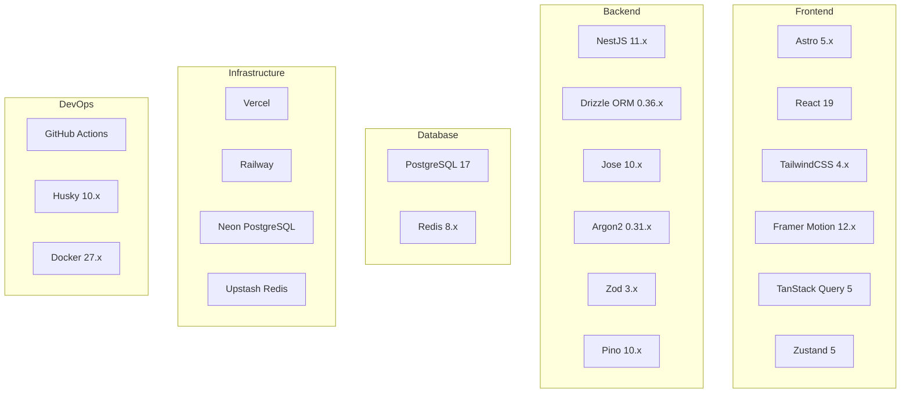
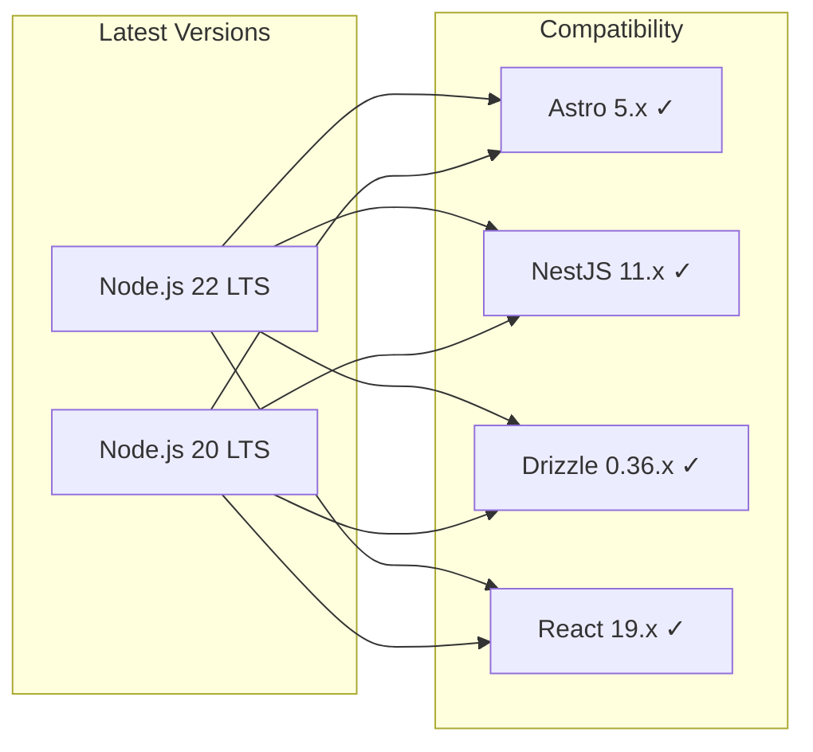
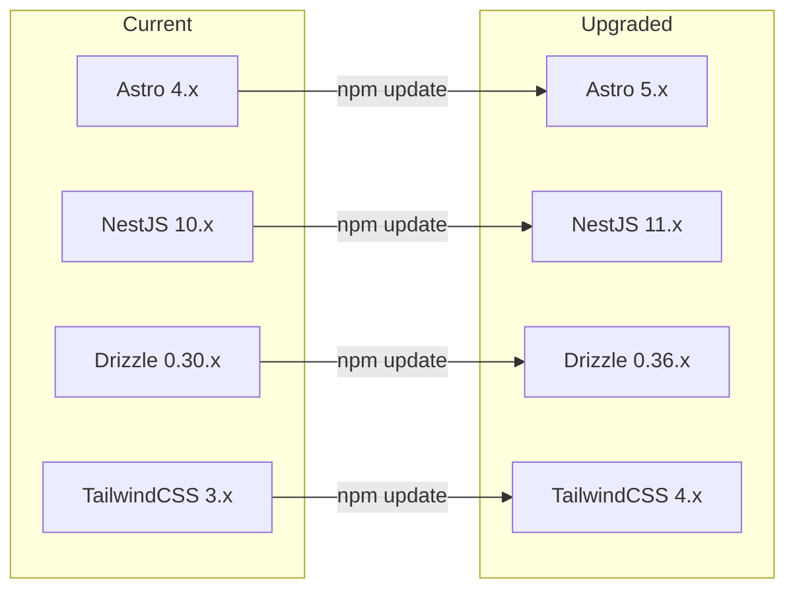
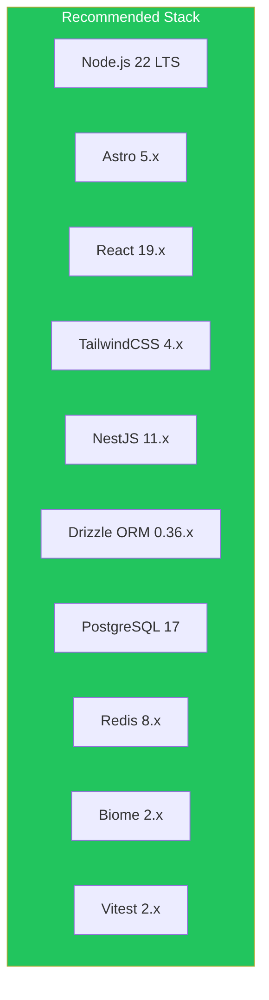

# Technology Stack Documentation

## Overview

Complete and up-to-date technology stack for Personal Portfolio CMS with separated Frontend and Backend architecture.

## Technology Stack Summary



## Frontend Stack

### Core Technologies

| Technology | Version | Purpose |
|------------|---------|---------|
| **Astro** | 5.x | Static site generation with Server Islands |
| **React** | 19.x | Interactive UI components |
| **TypeScript** | 5.8.x | Type-safe development |
| **TailwindCSS** | 4.x | Utility-first CSS framework (latest major) |

### Astro Configuration

```typescript
// astro.config.mjs
import { defineConfig } from 'astro/config';
import react from '@astrojs/react';
import tailwind from '@astrojs/tailwind';
import sitemap from '@astrojs/sitemap';
import vercel from '@astrojs/vercel';

export default defineConfig({
  output: 'static',
  adapter: vercel(),
  integrations: [
    react(),
    tailwind(),
    sitemap()
  ],
  vite: {
    ssr: {
      external: ['@astrojs/node']
    }
  }
});
```

**Note:** Astro 5.x changed from `output: 'hybrid'` to `output: 'static'` with the new Vercel adapter.

### TailwindCSS 4.x Configuration

TailwindCSS 4.x introduces a new CSS-first configuration approach:

```css
/* src/styles/globals.css */
@import "tailwindcss";

@theme {
  /* Primary Colors */
  --color-primary-50: #F0F9FF;
  --color-primary-100: #E0F2FE;
  --color-primary-200: #BAE6FD;
  --color-primary-300: #7DD3FC;
  --color-primary-400: #38BDF8;
  --color-primary-500: #0EA5E9;
  --color-primary-600: #0284C7;
  --color-primary-700: #0369A1;
  --color-primary-800: #075985;
  --color-primary-900: #0C4A6E;
  --color-primary-950: #082F49;
  
  /* Font Family */
  --font-sans: "Inter", system-ui, sans-serif;
  --font-mono: "JetBrains Mono", monospace;
}
```

### React Components

| Technology | Version | Purpose |
|------------|---------|---------|
| **React** | 19.x | UI library |
| **React DOM** | 19.x | DOM rendering |

### Styling

| Technology | Version | Purpose |
|------------|---------|---------|
| **TailwindCSS** | 4.x | Utility CSS |
| **@tailwindcss/typography** | 0.5.x | Prose styling |
| **clsx** | 2.x | Conditional classes |
| **tailwind-merge** | 3.x | Class merging |

### Animation & Interaction

| Technology | Version | Purpose |
|------------|---------|---------|
| **Framer Motion** | 12.x | Declarative animations |
| **Motion** | 11.x | Modern animation (Framer's new package) |

### State Management

| Technology | Version | Purpose |
|------------|---------|---------|
| **TanStack Query** | 5.x | Server state |
| **Zustand** | 5.x | Client state |
| **@tanstack/react-query** | 5.x | React bindings |

### Form Handling

| Technology | Version | Purpose |
|------------|---------|---------|
| **React Hook Form** | 8.x | Form state |
| **Zod** | 3.x | Validation |

### HTTP Client

| Technology | Version | Purpose |
|------------|---------|---------|
| **ofetch** | 1.x | Lightweight fetch |
| **ky** | 1.x | Elegant HTTP client |

### Icons

| Technology | Version | Purpose |
|------------|---------|---------|
| **Lucide React** | Latest | Icon library |
| **Phosphor Icons** | 2.x | Alternative icons |

### Content Processing

| Technology | Version | Purpose |
|------------|---------|---------|
| **marked** | 15.x | Markdown parsing |
| **expressive-code** | 1.x | Astro code blocks |
| **shiki** | 1.x | Syntax highlighting |

### SEO

| Technology | Version | Purpose |
|------------|---------|---------|
| **astro-seo** | Latest | SEO meta tags |
| **sitemap** | Latest | Sitemap generation |

## Backend Stack

### Core Framework

| Technology | Version | Purpose |
|------------|---------|---------|
| **NestJS** | 10.x | Progressive Node.js framework |
| **TypeScript** | 5.x | Type safety |
| **Node.js** | 22 LTS | Runtime |

### API & Validation

| Technology | Version | Purpose |
|------------|---------|---------|
| **@nestjs/core** | 10.x | Core framework |
| **@nestjs/common** | 10.x | Common utilities |
| **@nestjs/platform-express** | 10.x | Express adapter |
| **@nestjs/platform-fastify** | 10.x | Fastify adapter (faster) |
| **Zod** | 3.x | Runtime validation |
| **drizzle-zod** | Latest | Drizzle-Zod integration |

### Database

| Technology | Version | Purpose |
|------------|---------|---------|
| **Drizzle ORM** | 0.36.x | Type-safe ORM |
| **PostgreSQL** | 17.x | Primary database |
| **@neondatabase/serverless** | Latest | Neon serverless driver |

### Caching

| Technology | Version | Purpose |
|------------|---------|---------|
| **Redis** | 8.x | Cache & session |
| **ioredis** | 5.x | Redis client |
| **@upstash/redis** | Latest | Upstash SDK |

### Authentication

| Technology | Version | Purpose |
|------------|---------|---------|
| **Jose** | 10.x | JWT (Edge-compatible) |
| **jose** | 5.x | Browser-native JWT |
| **argon2** | 0.31.x | Password hashing |

### Security

| Technology | Version | Purpose |
|------------|---------|---------|
| **@nestjs/throttler** | 6.x | Rate limiting |
| **helmet** | 8.x | Security headers |
| **@fastify/cors** | Latest | CORS (if using Fastify) |
| **csurf** | Latest | CSRF protection |

### Logging

| Technology | Version | Purpose |
|------------|---------|---------|
| **Pino** | 10.x | High-performance logging |
| **pino-pretty** | Latest | Pretty printing |

### Testing

| Technology | Version | Purpose |
|------------|---------|---------|
| **Jest** | 29.x | Unit testing |
| **Vitest** | 2.x | Modern alternative to Jest |
| **@nestjs/testing** | 11.x | NestJS testing |
| **Supertest** | 6.x | HTTP testing |
| **Playwright** | 1.x | E2E testing |

### Development Tools

| Technology | Version | Purpose |
|------------|---------|---------|
| **drizzle-kit** | 0.22.x | Migrations |
| **tsx** | 4.x | TypeScript runner |
| **Biome** | 2.x | Linter & formatter |

## Infrastructure Stack

### Frontend Hosting

| Technology | Purpose |
|------------|---------|
| **Vercel** | Frontend deployment |
| **Cloudflare Pages** | Alternative |
| **Netlify** | Alternative |

### Backend Hosting

| Technology | Purpose |
|------------|---------|
| **Railway** | NestJS deployment |
| **Render** | Alternative |
| **Fly.io** | Edge deployment |
| **AWS ECS** | Enterprise |

### Database Hosting

| Technology | Purpose |
|------------|---------|
| **Neon** | Serverless PostgreSQL |
| **Supabase** | PostgreSQL + features |
| **CockroachDB** | Distributed PostgreSQL |
| **AWS RDS** | Managed PostgreSQL |

### Cache Hosting

| Technology | Purpose |
|------------|---------|
| **Upstash** | Serverless Redis |
| **Redis Cloud** | Managed Redis |
| **AWS ElastiCache** | Enterprise |

### Media Storage

| Technology | Purpose |
|------------|---------|
| **Cloudinary** | Image optimization |
| **AWS S3** | File storage |
| **Vercel Blob** | Built-in blob |

## DevOps Stack

### Package Manager

| Technology | Version | Purpose |
|------------|---------|---------|
| **npm** | 9.x | Fast package manager |

### Linting & Formatting

| Technology | Version | Purpose |
|------------|---------|---------|
| **Biome** | 2.x | All-in-one linter/formatter |
| **ESLint** | 9.x | Legacy linting |
| **Prettier** | 3.x | Legacy formatting |

### Git Hooks

| Technology | Version | Purpose |
|------------|---------|---------|
| **Husky** | 10.x | Git hooks |
| **lint-staged** | Latest | Lint staged files |

### Containerization

| Technology | Version | Purpose |
|------------|---------|---------|
| **Docker** | 27.x | Container runtime |
| **Docker Compose** | 2.x | Multi-container |

### CI/CD

| Technology | Purpose |
|------------|---------|
| **GitHub Actions** | CI/CD pipeline |
| **Dependabot** | Dependency updates |

## Version Compatibility Matrix

### Node.js Compatibility



| Package | Node 20 | Node 22 |
|---------|---------|---------|
| Astro 5.x | Yes | Yes |
| NestJS 11.x | Yes | Yes |
| Drizzle 0.36.x | Yes | Yes |
| React 19.x | Yes | Yes |
| TailwindCSS 4.x | Yes | Yes |

## Dependencies Structure

### Frontend package.json

```json
{
  "name": "@portfolio/frontend",
  "version": "1.0.0",
  "type": "module",
  "scripts": {
    "dev": "astro dev",
    "build": "astro build",
    "preview": "astro preview",
    "lint": "biome check .",
    "lint:fix": "biome check . --write",
    "typecheck": "astro check"
  },
  "dependencies": {
    "@astrojs/react": "^4.x",
    "@astrojs/tailwind": "^6.x",
    "@astrojs/vercel": "^8.x",
    "astro": "^5.x",
    "react": "^19.x",
    "react-dom": "^19.x",
    "@tanstack/react-query": "^5.x",
    "zustand": "^5.x",
    "framer-motion": "^12.x",
    "zod": "^3.x",
    "lucide-react": "^0.500.x",
    "clsx": "^2.x",
    "tailwind-merge": "^3.x"
  },
  "devDependencies": {
    "@biomejs/biome": "^2.x",
    "@types/react": "^19.x",
    "@types/react-dom": "^19.x",
    "tailwindcss": "^4.x",
    "typescript": "^5.8.x"
  }
}
```

### Backend package.json

```json
{
  "name": "@portfolio/backend",
  "version": "1.0.0",
  "type": "module",
  "scripts": {
    "start": "node dist/main",
    "start:dev": "tsx watch src/main.ts",
    "build": "tsc",
    "lint": "biome check .",
    "lint:fix": "biome check . --write",
    "test": "vitest",
    "test:e2e": "vitest run --config ./vitest.e2e.config.ts",
    "db:generate": "drizzle-kit generate",
    "db:migrate": "drizzle-kit migrate",
    "db:studio": "drizzle-kit studio"
  },
  "dependencies": {
    "@nestjs/common": "^11.x",
    "@nestjs/core": "^11.x",
    "@nestjs/platform-express": "^11.x",
    "@nestjs/jwt": "^11.x",
    "@nestjs/throttler": "^6.x",
    "argon2": "^0.31.x",
    "drizzle-orm": "^0.36.x",
    "ioredis": "^5.x",
    "jose": "^10.x",
    "pino": "^10.x",
    "pino-http": "^10.x",
    "zod": "^3.x"
  },
  "devDependencies": {
    "@biomejs/biome": "^2.x",
    "@nestjs/cli": "^11.x",
    "@nestjs/testing": "^11.x",
    "@types/node": "^22.x",
    "drizzle-kit": "^0.22.x",
    "tsx": "^4.x",
    "typescript": "^5.8.x",
    "vitest": "^2.x"
  }
}
```

## Migration Guide

### Upgrade Paths



### TailwindCSS 3.x to 4.x

```bash
# Install TailwindCSS 4.x
npm uninstall tailwindcss @tailwindcss/typography
npm install tailwindcss @tailwindcss/postcss

# Update config
# Old: tailwind.config.js
# New: CSS-based @theme configuration
```

### Jest to Vitest Migration

```bash
# Remove Jest
npm uninstall jest @types/jest

# Install Vitest
npm install -D vitest @vitest/coverage-v8
```

## Recommended Latest Stack



## Resources

| Technology | Documentation |
|------------|---------------|
| Astro | https://docs.astro.build |
| React 19 | https://react.dev |
| TailwindCSS 4 | https://tailwindcss.com/docs/upgrade-guide |
| NestJS 11 | https://docs.nestjs.com |
| Drizzle ORM | https://orm.drizzle.team |
| Biome | https://biomejs.dev |
| Vitest | https://vitest.dev |
