# Workflow Documentation - Personal Portfolio CMS

## Overview

This document describes all workflows including Git workflow, development process, authentication flow, and deployment pipeline.

## Git Workflow

### Branch Strategy

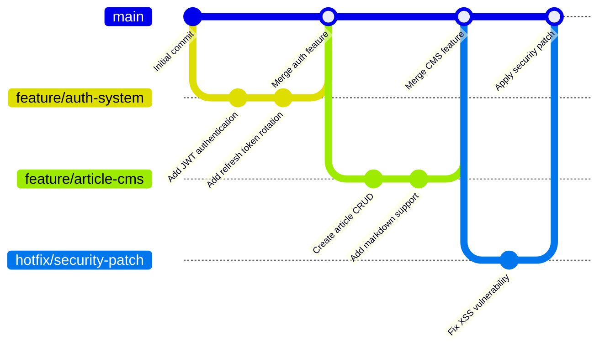

### Branch Naming Convention

| Branch Type | Pattern | Example |
|------------|---------|---------|
| Feature | `feature/description` | `feature/article-management` |
| Bug Fix | `fix/description` | `fix/login-redirect-issue` |
| Hotfix | `hotfix/description` | `hotfix/security-vulnerability` |
| Documentation | `docs/description` | `docs/api-documentation` |
| Refactor | `refactor/description` | `refactor/auth-service` |

### Commit Message Convention

Format: `type(scope): description`

```
<type>(<scope>): <subject>

[optional body]

[optional footer]
```

**Types:**

| Type | Description |
|------|-------------|
| `feat` | New feature implementation |
| `fix` | Bug fix |
| `docs` | Documentation changes only |
| `style` | Code style changes (formatting, no logic) |
| `refactor` | Code refactoring without feature/fix |
| `perf` | Performance improvements |
| `test` | Adding or updating tests |
| `chore` | Build process, dependencies, configs |

**Scopes:**

| Scope | Description |
|-------|-------------|
| `frontend` | Astro/React frontend changes |
| `backend` | NestJS backend changes |
| `auth` | Authentication system |
| `api` | API endpoints |
| `db` | Database schema or migrations |
| `config` | Configuration files |

**Examples:**

```bash
# Feature commit
feat(backend): add article CRUD endpoints

Implemented create, read, update, delete operations
for articles with proper validation and authorization.

Closes #123

# Bug fix commit
fix(auth): resolve token refresh race condition

Added mutex lock to prevent concurrent refresh token
generation that was causing invalid token errors.

# Documentation commit
docs: update API documentation

Added examples for pagination parameters and
updated response format for error codes.
```

## Development Workflow

### Feature Development Process

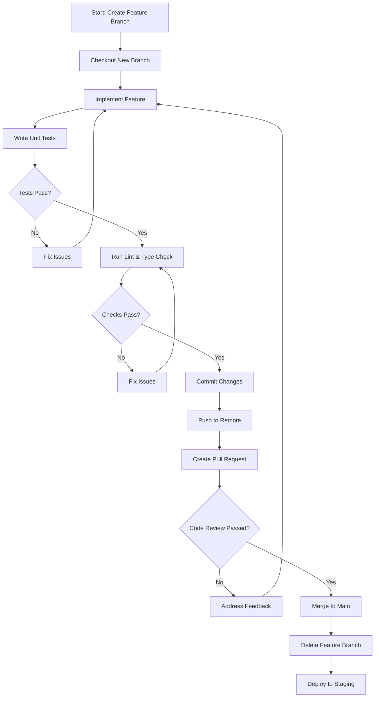

### Daily Development Routine

```bash
# 1. Start with updated main branch
git checkout main
git pull origin main

# 2. Create feature branch
git checkout -b feature/my-feature

# 3. Make changes and commit
git add .
git commit -m "feat(scope): describe changes"

# 4. Push and create PR
git push -u origin feature/my-feature

# 5. After review, merge and cleanup
git checkout main
git pull origin main
git branch -d feature/my-feature
```

### Code Review Process

**Before Requesting Review:**

```bash
# Run all checks locally
npm lint
npm typecheck
npm test
npm build
```

**Review Checklist:**

- [ ] Code follows naming conventions
- [ ] No hardcoded values (use constants)
- [ ] Error handling is comprehensive
- [ ] Tests cover edge cases
- [ ] Documentation updated if needed
- [ ] No console.log/debug statements
- [ ] Security considerations addressed

## Authentication Workflow

### Login Flow

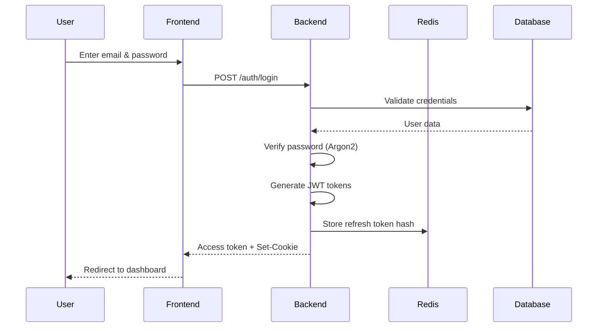

### Token Refresh Flow

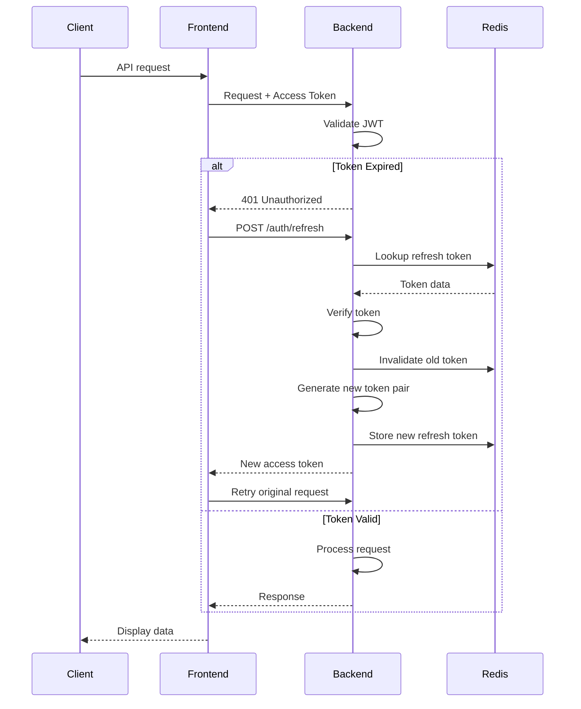

### Logout Flow

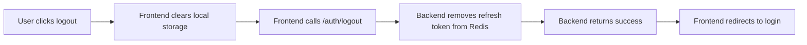

## API Workflow

### Request/Response Cycle

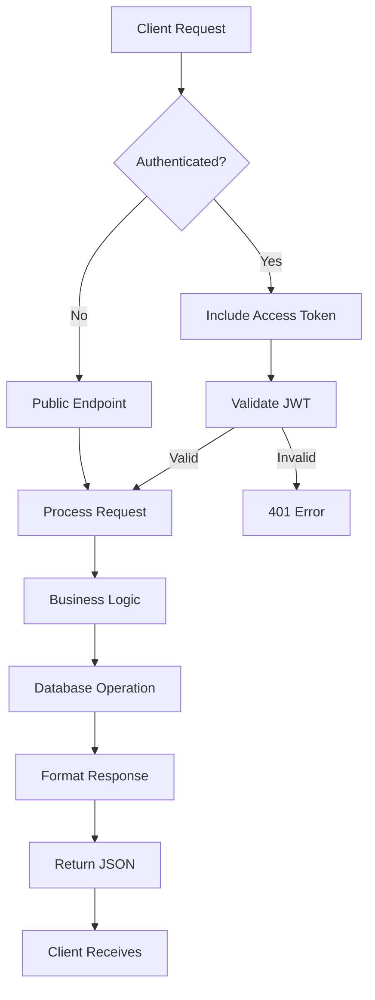

### Error Handling Flow

```mermaid
flowchart TD
    A[Request] --> B{Validation Pass?}
    B -->|No| C[Return 400 Bad Request]
    B -->|Yes| D{Authenticated?}
    D -->|No| E[Return 401 Unauthorized]
    D -->|Yes| F{Authorized?}
    F -->|No| G[Return 403 Forbidden]
    F -->|Yes| H{Resource Found?}
    H -->|No| I[Return 404 Not Found]
    H -->|Yes| J[Process Business Logic]
    J --> K{Operation Success?}
    K -->|No| L[Return 500 Internal Error]
    K -->|Yes| M[Return 200/201 Success]
    
    C --> N[Error Response Format]
    E --> N
    G --> N
    I --> N
    L --> N
    M --> O[Success Response Format]
    
    N[Error Response:<br/>success: false<br/>error: {code, message}]
    O[Success Response:<br/>success: true<br/>data: {...}]
```

## Deployment Workflow

### CI/CD Pipeline

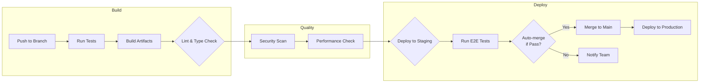

### Environment Stages

| Environment | Trigger | Purpose |
|------------|---------|---------|
| **Local** | Manual | Development |
| **Staging** | PR Merge | Testing & Review |
| **Production** | Main Push | Live Deployment |

### Deployment Process

```bash
# Staging Deployment (Automatic)
1. Push to feature branch
2. Create PR to main
3. CI runs tests & linting
4. Auto-deploy to staging on PR merge
5. Manual QA & testing
6. Approve for production

# Production Deployment
1. Merge to main branch
2. CI runs full test suite
3. Deploy to production
4. Health checks pass
5. Monitoring enabled
6. Slack notification sent
```

## Database Migration Workflow

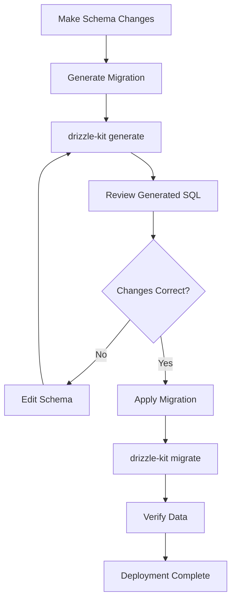

## Testing Workflow

### Test Pyramid

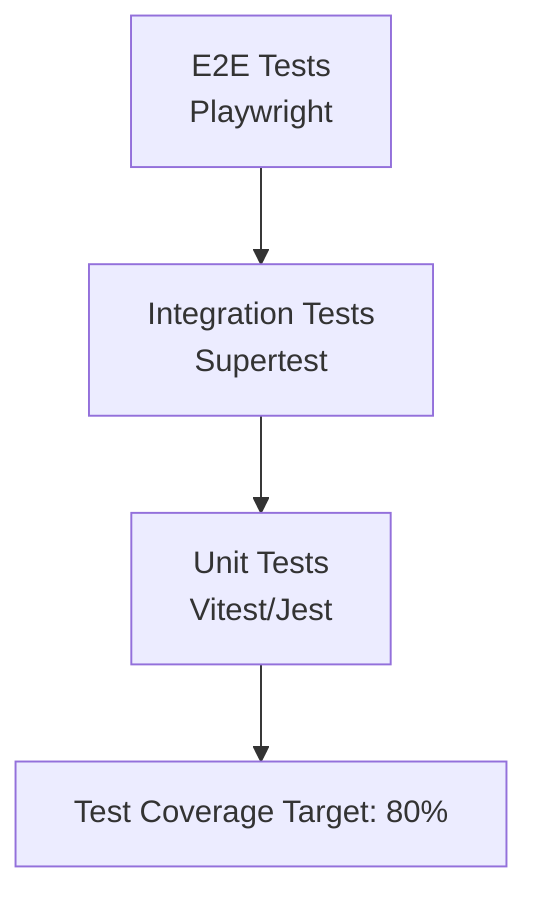

### Running Tests

```bash
# Unit tests
npm test                  # All tests
npm test --watch         # Watch mode
npm test --coverage     # With coverage report

# Specific test file
npm test auth.service.spec.ts

# Integration tests
npm test:e2e

# Before commit - run all
npm pre-commit-check
```

## Issue Tracking Workflow

### Issue Creation

```bash
# Bug Report Template
## Description
[Clear description of the bug]

## Steps to Reproduce
1. Go to '...'
2. Click on '...'
3. See error

## Expected Behavior
[What should happen]

## Actual Behavior
[What actually happens]

## Screenshots
[If applicable]

## Environment
- OS: [e.g., macOS 14.0]
- Browser: [e.g., Chrome 120]
- Node: [e.g., 20.10.0]
```

### Issue States

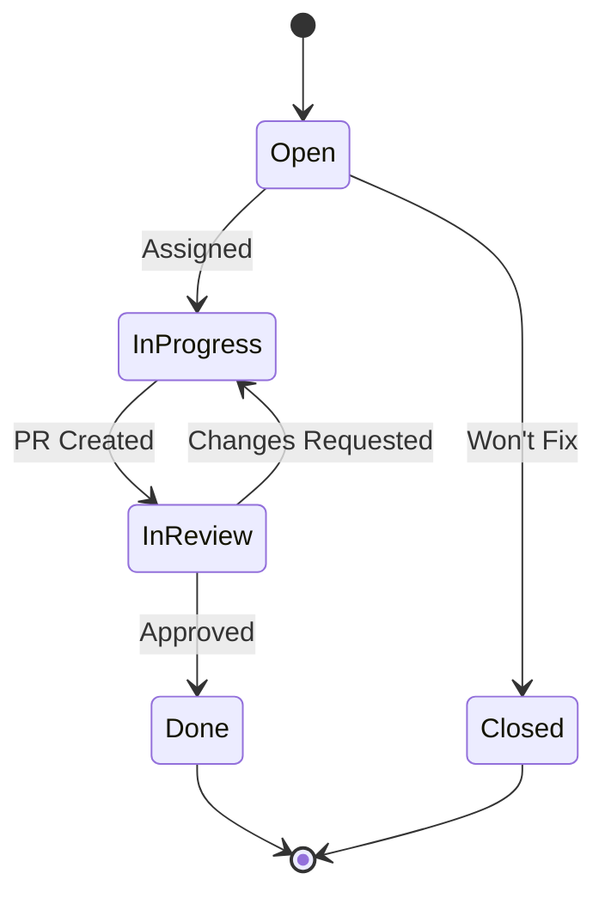

## Communication Workflow

### Team Communication Channels

| Channel | Purpose | Response Time |
|---------|---------|---------------|
| Slack | Quick questions | < 1 hour |
| GitHub Issues | Bug tracking | < 24 hours |
| Email | Formal communication | < 48 hours |

### Escalation Path

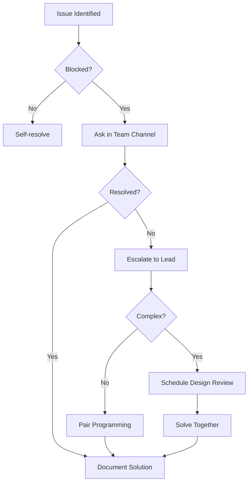

## Security Workflow

### Security Review Process

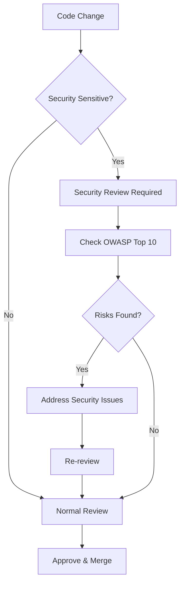

### Security Checklist

- [ ] Input validation on all user data
- [ ] SQL injection prevention (parameterized queries)
- [ ] XSS prevention (output encoding)
- [ ] CSRF tokens on mutations
- [ ] Secure password storage (Argon2)
- [ ] HTTPS only
- [ ] Rate limiting configured
- [ ] Secrets not in code
- [ ] Dependencies audited
- [ ] Security headers set
